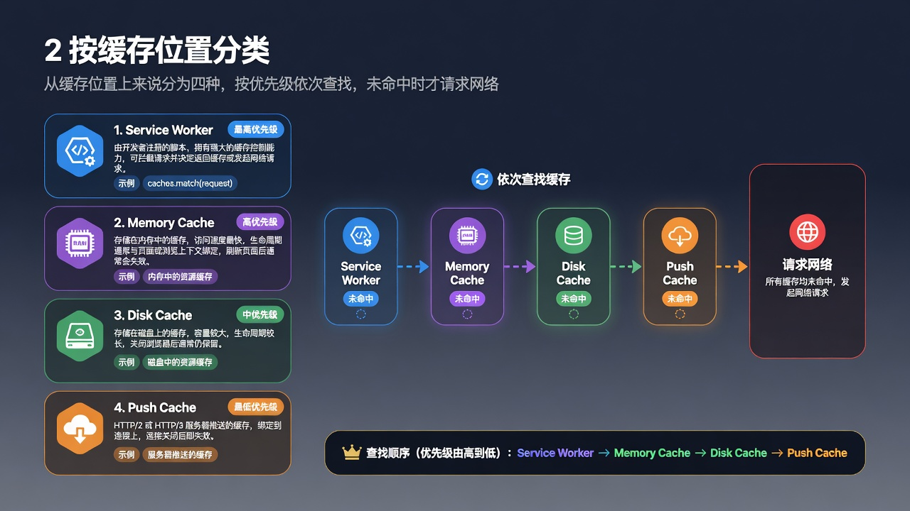
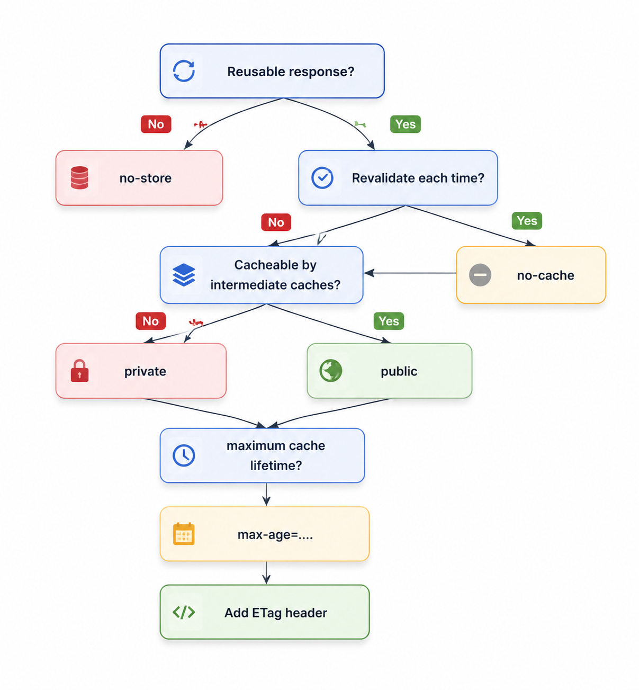
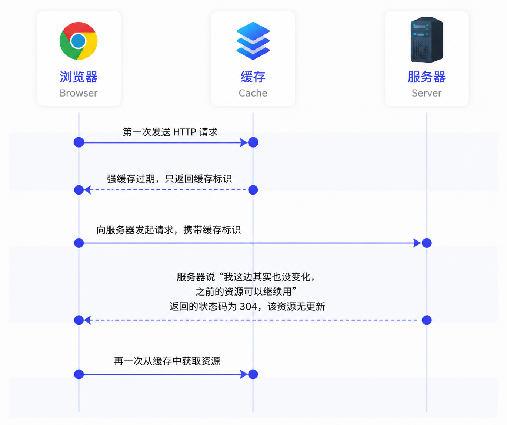

## 1 什么是浏览器缓存？

客户端向服务器发送 HTTP 请求时，服务器从数据库获取数据，然后进行计算处理，之后向客户端返回 HTTP 响应。整个流程当中可以在很多地方做缓存，例如：

- 数据库缓存（Redis）
- CDN 缓存
- 代理服务器缓存
- 浏览器缓存

以上所有地方加上缓存都能够很大程度优化整个 Web 应用的性能，本文注重于浏览器缓存。

## 2 按缓存位置分类



从缓存位置上来说分为四种，并且各组有优先级，当依次查找缓存且都没有命中的时候，才会去请求网络。这四种依次为：

- Service Worker
- Memory Cache
- Disk Cache
- Push Cache

### 2.1 Service Worker

Service Worker 是运行在浏览器的独立线程，一般可用于实现缓存功能。使用该功能时传输协议必须是 HTTPS，因为该功能涉及到请求拦截，所以必须使用 HTTPS 来保障安全。

Service Worker 的缓存与浏览器其他内建的缓存机制不同，它可以让我们自由控制缓存哪些文件、如何匹配缓存、如何读取缓存，并且缓存是持续性的。

Service Worker 实现缓存功能一般分为三个步骤：首先需要先注册 Service Worker，然后监听到 `install` 事件以后就可以缓存需要的文件，那么在下次用户访问的时候就可以通过拦截请求的方式查询是否存在缓存，存在缓存的话就可以直接读取缓存文件，否则就去请求数据。

当 Service Worker 没有命中缓存的时候，我们需要去调用 `fetch` 函数获取数据。也就是说，如果我们没有在 Service Worker 命中缓存的话，会根据缓存查找优先级去查找数据（也就是有可能命中其他缓存，如 Memory Cache）。

Service Worker 类似于代理服务器，经常和 PWA 一起连用，主要是能够让 Web 应用离线使用。

### 2.2 Memory Cache

Memory Cache 也就是内存中的缓存，主要是当前页面中已经下载的资源，例如样式、脚本、图片等。

读取内存比磁盘快，但是持续性较短，随着进程释放而释放。

Memory Cache 机制保证了一个页面中如果有两个相同的请求，例如相关 `src` 相同的 `img`、两个 `href` 相同的 `link`，都实际只会最多请求一次，避免浪费。

#### 哪些会进行内存缓存？

会进入 Memory Cache 的资源，本质上是**当前页面会话内已下载、体积较小、访问频繁或即将被使用的网络资源**。浏览器内核会根据资源类型、体积和访问频率自动决策，开发者无法直接干预（唯一例外是 `no-store`，能强制禁止缓存）。

**会进入 Memory Cache 的资源类型：**

| 类别 | 典型资源 | 进入内存缓存的原因 |
| --- | --- | --- |
| 派生资源 | JS 脚本、CSS 样式表 | 体积相对小、解析频繁、同页面内可能重复引用 |
| 小型图片 | 小尺寸图片、base64 / Data URI 图片 | base64 内联资源无独立网络请求，天然驻留内存；小图也常被留在内存 |
| 预加载资源 | `<link rel="preload">` 声明的资源 | preload 的语义就是「提前放进内存备用」，是显式占位内存的典型场景 |
| 字体文件 | Web Font（woff2 等） | 渲染文本时需要即时取用 |
| 接口数据 | 通过 XHR / Fetch 请求到的响应体 | 只要响应头允许缓存，也可能短期留内存 |
| 重复请求 | 同页面内 src/href 相同的 img、link、script | 内存缓存的核心职责：去重，第二个相同 URL 的请求直接命中内存 |

#### Memory Cache 与 HTTP 缓存头的关系

一个常被忽略的点：Memory Cache **基本不关心强缓存/协商缓存头**。只要资源已被下载且页面未关闭，浏览器在刷新时往往会直接从内存取，Network 面板显示 `from memory cache`，连条件请求都不发。

唯一能让 Memory Cache 失效的指令是 `Cache-Control: no-store`——它会同时禁止内存和磁盘缓存。

### 2.3 Disk Cache

Disk Cache 也就是存储在硬盘中的缓存，读取速度慢点，但是什么都能存储到磁盘中，比之 Memory Cache 胜在容量和存储时效性上。

在所有浏览器缓存中，Disk Cache 覆盖面基本是最大的。它会**根据 HTTP Header 中的字段判断哪些资源需要缓存，哪些资源可以不请求直接使用，哪些资源已经过期需要重新请求**。

并且即使在跨站点的情况下，相同地址的资源一旦被硬盘缓存下来，就不会再次去请求数据。绝大部分的缓存都来自 Disk Cache。

凡是持久性存储都会面临容量增长的问题，Disk Cache 也不例外。

在浏览器自动清理时，**会有特殊的算法去把「最老的」或者「最可能过时的」资源删除**，因此是一个一个删除的。不过每个浏览器识别「最老的」和「最可能过时的」资源的算法不尽相同，这也可以看作是各个浏览器差异性的体现。

### 2.4 Push Cache（尚未适配生产环境）

Push Cache 翻译成中文叫做「推送缓存」，是属于 HTTP/2 中新增的内容。

当以上三种缓存都没有命中时，它才会被使用。它只在会话（Session）中存在，一旦会话结束就被释放，并且缓存时间也很短暂，在 Chrome 浏览器中只有 5 分钟左右，同时它也并非严格执行 HTTP/2 头中的缓存指令。

一开始以为 HTTP/2 Push 能轻松解决页面加载性能问题，深入后发现它是一个更底层、更复杂的特性，而且浏览器支持差异很大，尚未完全适合生产环境，因此在国内并不常见。

基本工作原理：服务器在响应页面请求时，可以主动推送额外资源（如 CSS、JS、图片、JSON）。这些资源会进入连接级别的 Push Cache，等待浏览器后续请求匹配使用，从而减少往返延迟。

个人感觉 `link` 的 preload、prefetch 可以替代这个功能。为什么 Preload 更优？浏览器能够自己决定要不要下载（会检查缓存），不会像 Push 那样盲目推送，调试简单，Network 面板一目了然，支持跨域资源，不会绑定在 HTTP/2 连接上，行为更可预测，配合 `as` 属性可以精确控制优先级和资源类型。

preload（再配合 Early Hints）已经可以很好地替代 HTTP/2 Push 了，而且更可靠、更现代。Push 现在基本可以当成历史特性看待。

## 3 按照缓存类型分类

按照缓存类型来进行分类，可以分为强制缓存、协商缓存。强制缓存和协商缓存都属于 Disk Cache。

### 3.1 强制缓存

强制缓存，当客户端请求后，会先访问缓存数据库看缓存是否存在，**如果存在则直接返回**，效果就是不再发起请求，不存在则请求服务器响应后再写入缓存数据库当中。

强制缓存直接减少了请求次数，是提升最大的缓存策略，如果考虑使用缓存来优化网页性能，**强制缓存应该是首选**。

可以实现强制缓存的有两个 HTTP 响应头，其分别是 `Expires` 和 `Cache-Control`。

#### 3.1.1 Expires

```bash
Expires: Thu, 10 Nov 2026 08:45:11 GMT
```

这是 HTTP/1.0 定义的字段，表示缓存到期的时间，在响应头消息头当中设置这个字段之后就可以告诉浏览器，在未过期之前不需要再次请求。

这个字段有两个缺点：

1. 依赖客户端本地时间，用户将本地时间进行修改可能会导致缓存失效，甚至时区、时差、误差等因素也容易导致缓存失效。
2. 写法太复杂，表示时间的写法是文本字符串，一旦多个空格、少个符号则被认定为非法字符串导致设置失效。

#### 3.1.2 Cache-Control

在 HTTP/1.1 中增加了新的字段 `Cache-Control`，该字段表示资源缓存的最大有效时间，在该时间段内，客户端是不需要向服务器发送请求。

这两者的区别就是不需要指定过期时间，而且指定存活时长。

```bash
Cache-Control: max-age=2592000
```

一些常用的字段值：

- `max-age`：最大有效时间
- `must-revalidate`：如果超过了 max-age 的时长，浏览器必须向服务器发起请求，验证资源是否还有效
- `no-cache`：表面上说「不要缓存」，实际上客户端还是会缓存，只是是否使用这个缓存由协商缓存决定
- `no-store`：真正意义的「不要缓存」，表面意思是不要存储，设置了该值后，该资源不走任何缓存，包括强制缓存、协商缓存
- `public`：所有访问路径都可以缓存，例如客户端、代理服务器、CDN
- `private`：所有访问路径仅客户端可以缓存，代理服务器、CDN 不能缓存，默认值

这些值可以进行混用，他们的优先级是：



> **max-age=0 和 no-cache 等价吗？**
>
> 从规范的字面意思来说，max-age 到期是「应该重新验证」，而 no-cache 是「必须重新验证」。但实际情况以浏览器实现为准，大部分情况他们俩的行为还是一致的。如果是 `max-age=0, must-revalidate` 就和 `no-cache` 等价。

### 3.2 协商缓存

当强制缓存失效时，就需要使用协商缓存，由服务器决定缓存内容是否失效。

流程上说，浏览器先请求缓存数据库，返回一个缓存标识。之后浏览器拿这个标识和服务器通讯。如果缓存未失效，则返回 HTTP 状态码 304 表示继续使用，于是客户端继续使用缓存。



协商缓存在请求数上和没有缓存是一致的，但如果是 304 的话，返回的仅仅是一个状态码而已，并没有实际的文件内容，因此在响应体体积上的节省是它的优化点。

它的优化主要体现在「响应」上面：通过减少响应体体积，来缩短网络传输时间。所以和强制缓存相比提升幅度较小，但总比没有缓存好。

协商缓存是可以和强制缓存一起使用的，作为在强制缓存失效后的一种后备方案。实际项目中他们也的确经常一同出现。

协商缓存有两组，分别是 `Last-Modified` & `If-Modified-Since` 和 `ETag` & `If-None-Match`，第一个是响应头服务器返回回来的，第二个是前端请求头传递给后端的。

#### 3.2.1 Last-Modified & If-Modified-Since

1. 服务器通过 `Last-Modified` 字段告知客户端，资源最后一次被修改的时间，例如：

```bash
Last-Modified: Tue, 28 Jul 2026 06:59:14 GMT
```

2. 浏览器将这个值和内容一起记录在缓存数据库中。
3. 下一次请求相同资源时，浏览器从自己的缓存中找出「需要验证或者可能过期的」缓存。因此在请求头中将上次的 `Last-Modified` 的值写入到请求头的 `If-Modified-Since` 字段。
4. 服务器会将 `If-Modified-Since` 的值与 `Last-Modified` 字段进行对比。如果相等，则表示未修改，响应 304。

但是它还是有一定缺陷的：

- 如果资源更新的速度是**秒以下单位**，那么该缓存是不能被使用的，因为它的时间单位最低是秒。
- 如果文件是通过服务器动态生成的，那么该方法的**更新时间永远是生成的时间**，尽管文件可能没有变化，所以起不到缓存的作用。

#### 3.2.2 ETag & If-None-Match

为了解决上述问题，出现了一组新的字段 `ETag` 和 `If-None-Match`。

ETag 存储的是文件的特殊标识（一般都是一个 Hash 值），服务器存储着文件的 ETag 字段。

浏览器在下一次加载资源向服务器发送请求时，会将上一次返回的 ETag 值放到请求头里的 `If-None-Match` 里，服务器只需要比较客户端传来的 `If-None-Match` 跟自己服务器上该资源的 ETag 是否一致，就能很好地判断资源相对客户端而言是否被修改过了。

如果服务器发现 ETag 匹配不上，那么直接以常规 GET 200 回包形式将新的资源（当然也包括了新的 ETag）发给客户端；如果 ETag 是一致的，则直接返回 304 告诉客户端直接使用本地缓存即可。

ETag 是需要服务器或 Nginx 计算得出的文件 hash 值，常见是文件内容哈希。

#### 3.2.3 两者对比

- 首先在精确度上，ETag 要优于 Last-Modified。Last-Modified 的时间单位是秒，如果某个文件在 1 秒内改变了多次，那么 Last-Modified 其实并没有体现出来修改，但是 ETag 是一个 Hash 值，每次都会改变从而确保了精度。
- 在性能上，ETag 要逊于 Last-Modified，毕竟 Last-Modified 只需要记录时间，而 ETag 需要服务器通过算法来计算出一个 Hash 值。
- 在优先级上，服务器校验优先考虑 ETag，也就是说 ETag 的优先级高于 Last-Modified。

## 4 浏览器行为

用户对浏览器的不同操作，会触发不同的缓存读取策略。

对应主要有 3 种不同的浏览器行为：

- **打开网页，地址栏输入地址**：查找 Disk Cache 中是否有匹配。如有则使用；如没有则发送网络请求。
- **普通刷新 (F5)**：因为 TAB 并没有关闭，因此 Memory Cache 是可用的，会被优先使用（如果匹配的话）。其次才是 Disk Cache。
- **强制刷新 (Ctrl + F5)**：浏览器不使用缓存，因此发送的请求头部均带有 `Cache-Control: no-cache`（为了兼容，还带了 `Pragma: no-cache`）。服务器直接返回 200 和最新内容。

## 5 缓存的最佳实践

### 5.1 频繁变动的资源

- **`Cache-Control: no-cache`**
  对于频繁变动的资源，需使用 `Cache-Control: no-cache` 让浏览器每次都请求服务器，再配合 `ETag` 或 `Last-Modified` 验证资源有效性。此方式虽无法减少请求数，但能显著降低响应数据体积。

### 5.2 不常变化的资源

- **`Cache-Control: max-age=31536000`**
  处理这类资源时，为其配置 `Cache-Control: max-age=31536000`（一年），使浏览器后续请求相同 URL 时命中强制缓存。
  为解决更新问题，需在文件名（或路径）中添加 Hash、版本号等动态字符；更新时修改动态字符，从而改变引用 URL，让旧强制缓存失效（实际未立即失效，仅不再使用）。
