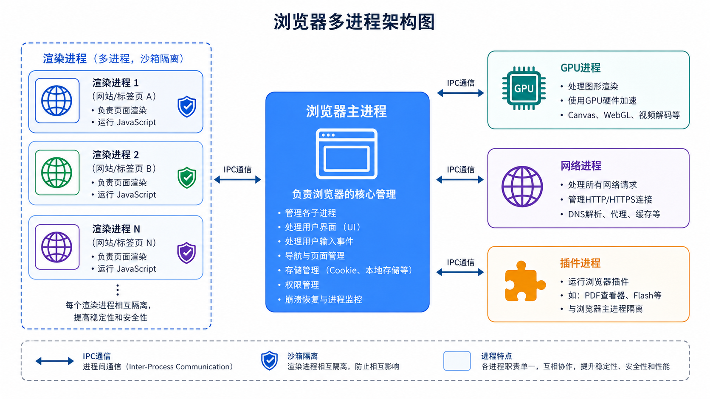
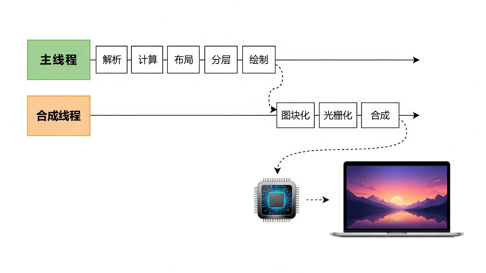
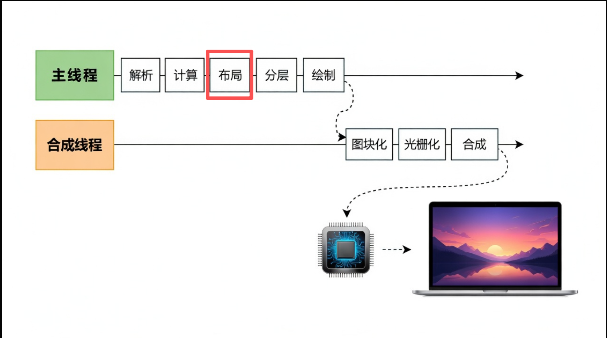
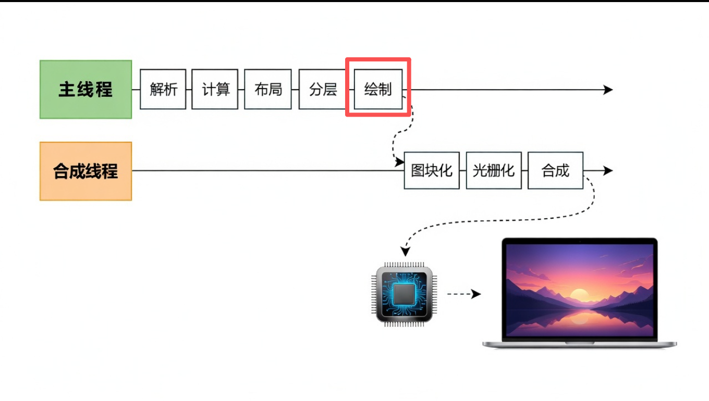
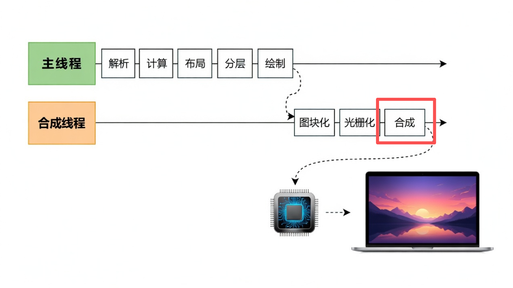
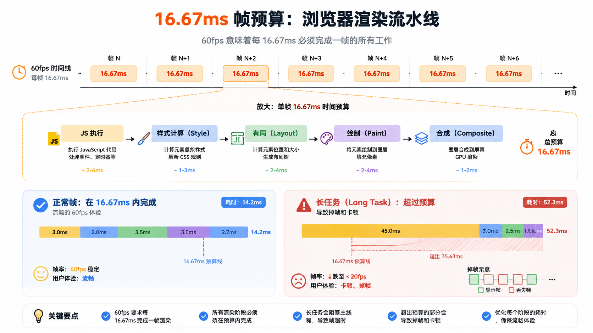

## 1 进程与线程的基础概念

### 进程

- **定义**：正在运行的程序的实例，是操作系统进行资源分配和调度的基本单位。
- **特点**：拥有独立的地址空间、系统资源，进程相互隔离。
- **缺点**：创建、切换、销毁开销很大。

### 线程

- **定义**：进程内的一个执行路径，是 CPU 调度和执行的最小单位。
- **共享资源**：同一进程的线程共享代码段、数据段、堆、文件等资源。
- **独立资源**：每个线程拥有独立的程序计数器、寄存器组和栈空间。
- **优点**：创建、切换、销毁的开销较小。

### 为什么要有线程？

进程用来分配资源，线程用来分工合作，从而实现高效并发。

---

## 2 浏览器的多进程架构

### 2.1 主要进程类型

浏览器实际上是多进程的，但要注意：**渲染进程是按网站的域级别去分配进程，而不是按标签页**。

进程至少有：

1. **浏览器主进程**：负责界面显示、用户交互、子进程管理。
2. **渲染进程**：专门负责渲染解析网页；在该进程内会再细分更多线程。
3. **GPU 进程**：专门负责 3D 绘制、硬件加速、光栅化等。
4. **网络进程**：专门负责网络请求；在该进程内也会再细分更多线程。

> 浏览器主进程统一调度子进程，各司其职，相互隔离。

### 2.2 渲染进程的分配策略

如前所述，渲染进程按站点域级别分配，而不是标签页。

- **策略**：按站点（Site = 协议 + 域名）分配渲染进程。
- **规则**：不同站点必须使用不同的渲染进程（安全隔离）；同一站点可能共享同一个渲染进程。

## 3 渲染进程内部的线程分析

其他进程我们并不太关心。前端更关心**渲染进程**——它解释了大量白屏现象，也对应许多优化手段。

每个渲染进程包含多个线程，分别是：

| 线程名称 | 职责 |
| --- | --- |
| **主线程** | 执行 JS、构建 DOM / CSSOM、样式计算、布局树生成、分层树生成、绘制指令集生成。 |
| **预解析线程** | 快速扫描 HTML，提前发现需要加载的资源（外部 CSS、JS、图片等）并提前发起网络请求。 |
| **合成器线程** | 接收主线程的绘制指令，进行分块（会创建多个分块线程并行分块，每个称为分块器）、光栅化（将每个块变成位图；光栅化交付给 GPU 进程，以极高速度完成，GPU 进程会开多线程并优先处理可视区域）、合成（GPU 光栅化后返回 quad 指引给合成线程，合成线程计算各位图位置，再通过 IPC 交给 GPU 进程或浏览器进程最终呈现）。 |
| **Worker 线程** | 执行 Web Worker 代码，可与主线程并行运算。 |

网上常说「JS 是单线程」，容易误解成浏览器里有一个单独的「JS 线程」。其实不然：在渲染进程中执行 JS 的是**主线程**。HTML 解析 DOM 时若遇到 JS 脚本，会立即停止解析 DOM，转而先执行 JS；而这段逻辑同样跑在主线程上，所以大家笼统说 JS 是单线程。但主线程远不止执行 JS，还负责样式、布局、绘制等大量工作。

因此也能理解：**为什么执行 JS 会卡住渲染**——它们本来就在同一个主线程里，JS 执行时 DOM 解析当然要停。

那为什么要这么设计？因为 JS 可能马上改动 DOM；此时必须停下来先跑完 JS，再继续渲染。这是没法绕开的选择。

现代可以用 Worker 线程执行 JS，从而不阻塞主线程，但代价是 **Worker 里不能改 DOM**。

还有别的办法吗？把 JS 尽量放到 DOM 之后，先渲染再执行逻辑。现代浏览器也提供了 `async`、`defer`、`prefetch`、`preload` 等手段，控制脚本何时加载、何时执行。

## 4 一些关于渲染进程的问题

### 4.1 重排

重排就是重新生成布局树（layout），如下图所示。

什么是 reflow？

reflow 的本质就是**重新计算 layout 树**。

当进行了会影响布局树的操作后，需要重新计算布局树，会引发 layout。

为了避免连续多次操作导致布局树反复计算，浏览器会合并这些操作，等 JS 代码全部完成后再统一计算。所以，改动属性造成的 reflow 往往是**异步**完成的。

也正因为如此，当 JS 获取布局属性时，可能拿不到最新的布局信息。

浏览器在反复权衡后，最终决定：**获取布局属性时立即 reflow**。

### 4.2 重绘

重绘就是重新生成绘制指令集（paint），如下图所示。

repaint 的本质就是**根据分层信息重新计算绘制指令**。

当改动了可见样式后，就需要重新计算，会引发 repaint。

由于元素的布局信息也属于可见样式，所以 **reflow 一定会引起 repaint**。

### 4.3 为什么 transform 的效率高？

因为 transform 既不会影响布局，也不会影响绘制指令，它影响的只是渲染流程的最后一个 **draw** 阶段。

由于 draw 阶段在合成线程中，所以 transform 的变化几乎不会影响渲染主线程。反之，渲染主线程无论如何忙碌，也不太会拖累 transform 动画。

### 4.4 16.67ms 帧预算与长任务

浏览器刷新频率通常为 60fps（每秒 60 帧）。

每帧总预算约为 **16.67ms**（1000ms / 60 ≈ 16.67ms）。

在这个时间内，主线程必须完成 JS 执行 → 样式计算 → 布局 → 绘制，并为合成器线程留出合成时间。如果主线程任务超过此预算（特别是连续多帧），浏览器无法按时提交新画面，导致掉帧，用户感知为卡顿。

无论哪种场景，瓶颈往往都是：**渲染进程的主线程被长任务持续占用**，导致浏览器无法在 16.67ms 内完成一帧的渲染工作。

如果主线程在 16.67ms 内交付了，但表现还是有点卡？比如主线程花了 15ms 完成，看起来没超时，但合成器线程只剩不到 2ms 去做合成，大概率也来不及，这一帧还是会丢。所以，**一帧总预算 16.67ms 需要所有阶段分摊**。

为了稳定达到 60fps，主线程在每一帧中处理 JS、布局、绘制等任务的总时长，必须**远小于 16.67ms**（通常建议在 10–12ms 以内），才能为后面的合成和显示留出时间。一旦主线程连续占用过长时间，浏览器就无法按时提交新画面，用户就会感到卡顿。

这也解释了实战中常见的现象：性能面板里 JS 执行大约只有 16ms 上下，但滚动仍然卡卡的——主线程把预算几乎吃完，合成阶段没有余量。

**优化方向：**

1. **分片**：使用 `requestAnimationFrame` 或 `requestIdleCallback` 拆分长任务。
2. **虚拟滚动**：只渲染可视区域节点，避免大量 DOM 操作。
3. **Web Worker**：将纯数据计算移出主线程。
4. **编译时优化**：使用 Svelte / Solid 等框架，减少运行时 DOM 开销。
