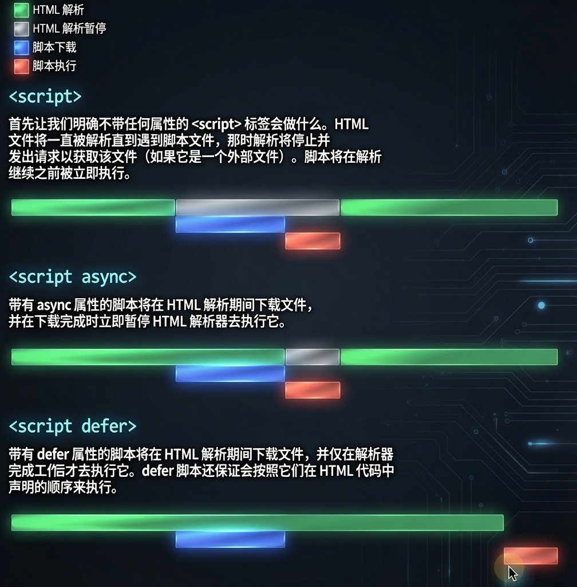

## 1 渲染阻塞回归

上篇文章我们了解了浏览器渲染进程的主线程工作：在解析 DOM 树时，如果遇到 `script` 标记，则必须立即执行并等待；如果是外部脚本，则需要先下载再执行并等待。

为什么解析必须停止呢？

因为 JS 可以通过脚本改变 DOM 结构，必须等它执行完毕后才能拿到最终的 DOM 树。同样的道理，如果 JS 代码会访问 CSSOM，那么必须等待 CSS 解析并可用时才会执行 JS 代码，否则会阻塞 JS 的执行。

CSS 虽然不会阻塞 DOM 的构建，但在上述情况下会阻塞 JS 的执行。最终渲染需要 DOM 和 CSSOM 都完成后才会进行样式计算、构建渲染树；在此之前浏览器显示的都是白屏。

## 2 defer 与 async

现代浏览器引入了 `defer` 和 `async`。

**async** 表示解析 DOM 时，该脚本的下载可以与 DOM 解析并行进行（异步加载）；下载完毕后立即执行，并阻塞 DOM 解析。也就是说：下载 JS 时不再阻塞解析 DOM，但下载完毕后需要马上执行，此时会阻塞 DOM 解析。

**defer** 表示解析 DOM 时，该脚本的下载同样可以与 DOM 解析并行进行（异步加载）；下载完毕后需要等所有 DOM 树构建好、在 `DOMContentLoaded` 事件触发之前才执行。也就是说：下载 JS 时不会阻塞解析 DOM，并且需要等待整个 DOM 解析完成后再执行 JS。

## 3 preload

`preload` 顾名思义就是预加载。该资源提示支持 `link` 和 `script`。声明了 `preload` 后，浏览器会先加载相关资源；在随后的页面渲染中，一旦需要用到就可以立即使用。可以用 `as` 指定将要预加载的内容类型（`style`、`script`、`image`、`font`、`document` 等）。

主要是通过自定义资源优先级，预加载某些热点资源，让页面加载更快。传统方式需要按 DOM 结构顺序进行解析。

## 4 prefetch

`prefetch` 是一种利用浏览器的空闲时间预加载将来可能用到的资源，对标 JS 的 `requestIdleCallback()`。

还有一个比较少见的 **DNS prefetching**：

DNS prefetching 允许浏览器在用户浏览时在后台对页面执行 DNS 查找。这最大限度地减少了延迟，因为一旦用户单击链接，DNS 查找往往已经完成。

通过将 `rel="dns-prefetch"` 添加到链接属性，可以对特定 URL 启用 DNS prefetching。建议在 Web 字体、CDN 等资源上使用它。

## 5 prerender

`prerender` 与 `prefetch` 非常相似：`prerender` 针对接下来可能用到的页面做优化，浏览器会在后台渲染整个页面。

## 6 preconnect

`preconnect` 允许浏览器在 HTTP 请求发起前做好早期连接。

浏览器建立一个连接需要：DNS 查找、TCP 三次握手、TLS 协商（HTTPS）。
