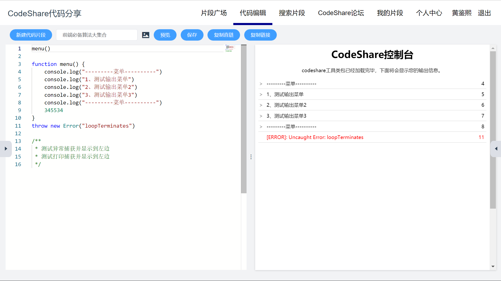
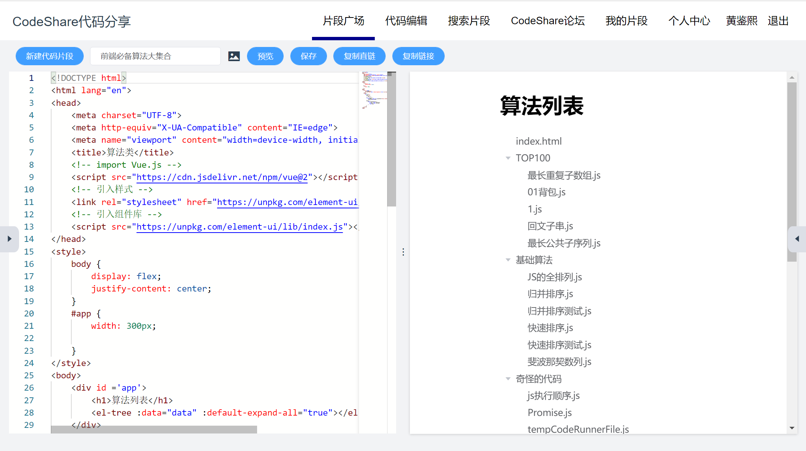
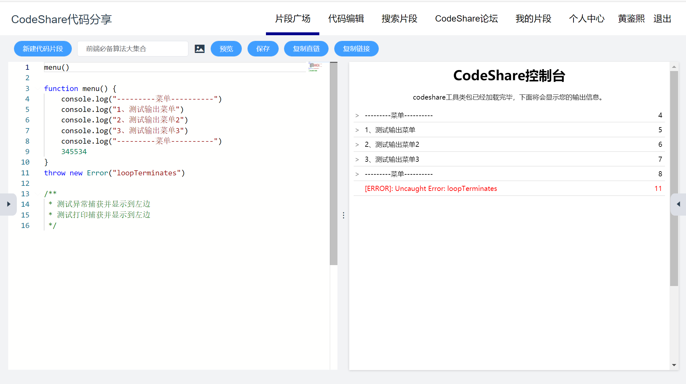
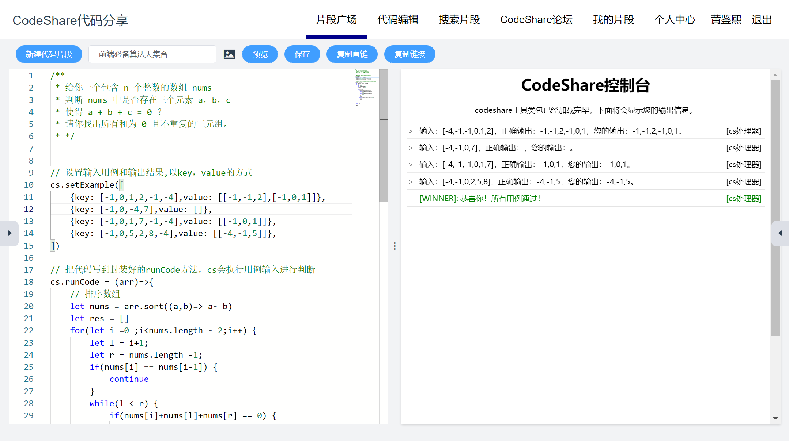

## CodeShare是什么
codeshare是我最近一直在开发的在线代码分享平台，一直以来都是通过以下代码实现代码预览。

```javascript
this.$refs.preview_iframe.contentWindow.document.write(content) // 动态写入返回页面到iframe
this.$refs.preview_iframe.contentWindow.document.close()
```

## 漏洞发现及危害
在重写console.log方法捕获用户代码输入输出实现js文件调试和在线判题的功能。我脑袋灵感一闪，看看能不能获取到主网站的token，codeshare网站使用token进行认证身份，并且会保存在localStorage，方便用户刷新页面后也能自动登录。

于是我在codeshare输入框输入以下代码并执行预览：
```javascript
/**
 * 测试非法调用造成xss、csrf攻击
 * codeshare代码预览前将会做一次过滤处理
 */
console.log(window.localStorage.getItem('token'))
console.log(window.document.cookie)
console.log(window.parent.localStorage.getItem("token"))
console.log(window.parent)
console.log(window.localStorage.token)
console.log(window.parent.localStorage.token)
console.log(window.localStorage)
```

显然结果很不好，打印了token出来，如果恶意代码进行跨域请求就可以把token发送到攻击者的服务器上，攻击者就可以以用户的身份登录到codeshare，当然我的token是有有效期的。
并且还可以操作window.parent，实现主窗口的修改，如非法添加或修改按钮、非法注入恶意代码等。
因为已经修复了，所以这里放个codeshare捕获输出错误并显示到右边的截图供大家观看。



## 解决方法
### 1. 过滤大法
首先我们的预览流程是：
- 用户点击预览后
- 获取到片段或文件代码
- 判断类型，选定编辑器提示类型，以及预览类型
- 刷新iframe以恢复初始化
- 并执行上面的语句动态写入页面到iframe

那我能不能把敏感的关键词过滤了这样就不会执行相应的代码呢？

显然是可以的，因此写了以下的代码执行安全维护。

```javascript
        /**
         * 安全维护函数
         * 将会去除代码敏感关键词
         * @Ahthor: xiaoxi
         * @param {*} content
         */
        SecurityMaintenance(content) {
            let words = [
                'parent',
                'localStorage',
                'token',
                'document',
                'window'
                ]
            for (const iterator of words) {
                content = content.replaceAll(iterator ,'禁止使用')
            }
            return content
        }
```

此代码将会把所有敏感关键词替换成文本，使其代码无法运行，codeshareUtils脚本将会捕获错误显示到预览框。

效果很不错，代码运行后确实无法运行，然而……

1个小时后我又想到了一个办法就是动态加载js脚本，这样这个脚本里面的关键词我就无法过滤从而实现运行恶意代码。

### 2. sandbox沙箱模式
因此，要保证绝对的安全，必须是完完全全禁止敏感API的调用，使接口都不提供数据给片段代码。

通过三七二十一的Bing搜索，得知iframe 的 sandbox模式可以控制iframe的权限，实现iframe的代码在沙箱运行。（其实codeshare早就用到了这个特性）

sandbox有以下属性：

|属性|值|
|-------|-------|
|allow-same-origin|允许 iframe 内容被视为与包含文档有相同的来源。|
|allow-top-navigation|允许 iframe 内容从包含文档导航（加载）内容。|
|allow-forms|允许表单提交。|
|allow-scripts|允许脚本执行。|

只需要给iframe添加sanbox就可以限制全部的功能，但是因为需要代码预览，一般允许 allow-forms 、allow-scripts 。

如下的代码：

```javascript
<iframe
	class="xx-iframe"
	frameborder='0'
	sandbox="allow-scripts allow-popups allow-forms allow-modals"
	ref="preview_iframe"
	style="width:100%;height:100%;"
></iframe>
```

此时iframe访问资源就会产生跨域问题，从而实现不允许访问localStorage、cookie等。

但是同时父窗口也会产生跨域问题，就没办法通过document.write动态写入页面到iframe。以上的预览方式要进行更改，要更换一种预览方式。

此时能够操作iframe显示的内容的只有src和srcdoc属性。考虑到srcdoc只能实现html代码的预览传递含有script脚本的将无法执行js，所以得使用src预览页面。

src方式预览代码，可以使用 data:text/html;charset=utf-8 方式，把html代码进行encodeURIComponent编码传递给iframe即可进行预览。

代码如下：

```javascript
        goPreview(content, type) {
            this.$refs.preview_iframe.src = '/mock/default.html'
            switch (type) {
                case 'javascript':
                    let code = `
                        <body><\/body>
                        <script src="${window.location.origin}/js/codesharePreviewUtils.js"><\/script>
                        <script>
                            ${content}
                        <\/script>
                    `
                    this.$refs.preview_iframe.src = `data:text/html;charset=utf-8,${encodeURIComponent(code)}`
                    break;
                default:
                    this.$refs.preview_iframe.src = `data:text/html;charset=utf-8,${encodeURIComponent(content)}`
                    break;
            }
        },
```

此处是codeshare的预览代码，判断文件类型，如果是js文件将会自动引入codesharePreviewUtils.js 的工具类包，实现输入输出、错误捕获，实现判题系统的功能，以后将会提供更多的封装方法，对象是 cs。

html页面预览：



js文件预览：



判题系统显示：



通过上面的代码，让我更加了解iframe这个大家都不喜欢的玩意，其实也很有用的。再往后我将会分享codesharePreviewUtils.js如何捕获用户输出和错误从而显示到iframe里面实现输出显示而不用打开F12，以及判题系统的实现。
