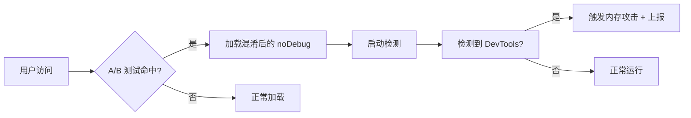

## 1 前言

近日想通过 AI 获取包含「AI 全栈、AI 前端、AI Agent」关键词的岗位，收集相关的岗位资讯并分析岗位职责与要求，来规划未来的学习。偶然发现某招聘的前端反爬安全机制比一般站点还要严格许多，甚至开发者工具都无法打开，表现为一打开就跳转到首页，导致信息无法采集。

代码混淆后，人根本看不懂，然而能力出众的 GLM-5.2 还是成功分析出来了，感慨现在的 AI 真的强大。

## 2 分析情况

GLM-5.2 分析出来某招聘的前端反爬机制是基于开源库 [disable-devtool](https://github.com/theajack/disable-devtool) 实现的定制版本。

其中魔改了以下内容：

| 魔改内容 | 具体实现与详情 |
| --- | --- |
| **字符串加密** | 自己实现了字符串替换 + XOR「19891636」+ base64（原始库为明文代码） |
| **方法名混淆** | `init`→`XCIT`、`check`→`XCID`、`isUsing`→`OXUE` 等 |
| **内存压力攻击** | 每 10ms 分配 10MB 数组（原始库无此机制） |
| **全局 Canary Token** | 设置 `window.MMPT` / `OOPS` / `SEWO` / `BOPI` 等噪音 |
| **自定义上报** | 通过 `fetch` / `sendBeacon` 上报到数星埋点系统 |
| **A/B 测试控制** | 通过 `getABData` 控制是否启用，非全量开启 |

核心检测引擎是 disable-devtool 原版，但在混淆强度、反逆向、环境完整性检查和上报方面做了大量自研增强。

## 3 disable-devtool 开源库

我们先看看 disable-devtool 这个开源库是怎么工作的？这里我们利用 GLM-5.2、DeepWiki 辅助分析仓库。

这是一种旨在防止用户访问浏览器开发工具的 JavaScript 安全工具。它通过检测开发者工具是否被打开并采取可配置的操作，保护网页应用免受未经授权的代码检查、分析和操作。

该库有以下特性：

- 支持可配置是否禁用右键菜单
- 禁用 F12 和 Ctrl+Shift+I 等快捷键
- 支持识别从浏览器菜单栏打开开发者工具并关闭当前页面
- 开发者可以绕过禁用（URL 参数使用 tk 配合 md5 加密）
- 多种监测模式，支持几乎所有浏览器（IE、360、QQ 浏览器、Firefox、Chrome、Edge…）
- 高度可配置、使用极简、体积小巧
- 支持 npm 引用和 script 标签引用（属性配置）
- 识别真移动端与浏览器开发者工具设置插件伪造的移动端，为移动端节省性能
- 支持识别开发者工具关闭事件
- 支持可配置是否禁用选择、复制、剪切、粘贴功能
- 支持识别 eruda 和 vconsole 调试工具
- 支持挂起和恢复探测器工作
- 支持配置 `ignore` 属性，用以自定义控制是否启用探测器
- 支持配置 iframe 中所有父页面的开发者工具禁用

### 3.1 目录结构分析

主源码目录：

```text
src/
├── index.ts        入口导出，默认导出 disableDevtool 函数
├── main.ts         主流程：初始化环境 → 合并配置 → 校验 tk → 启动定时器/快捷键禁用/检测器
├── type.d.ts       IConfig / IDisableDevtool 类型定义
├── version.ts      版本号常量（构建时由脚本写入）
├── detector/       检测器模块（核心）
├── utils/          通用工具模块
└── plugins/        插件模块（script 属性解析、ignore 规则）
```

`src/detector/` —— 检测器模块：

| 文件 | 作用 |
| --- | --- |
| `detector.ts` | 抽象基类 `Detector`，定义 `detect()` 抽象方法与 `onDevToolOpen()` 触发流程 |
| `index.ts` | 按 `DetectorType` 枚举注册并实例化 8 个子检测器的工厂入口 |
| `sub-detector/reg-to-string.ts` | 通过重写 `RegExp.toString` 检测（仅 QQ 浏览器 / Firefox） |
| `sub-detector/define-id.ts` | 通过 `Object.defineProperty` 在 DOM id getter 中检测 |
| `sub-detector/size.ts` | 通过 `window.outerWidth/outerHeight` 与 `innerWidth/innerHeight` 差值检测 |
| `sub-detector/date-to-string.ts` | 通过重写 `Date.toString` 检测 |
| `sub-detector/func-to-string.ts` | 通过重写 `Function.toString` 检测 |
| `sub-detector/debugger.ts` | 通过 `debugger` 语句的时间差检测（仅 iOS Chrome/Edge 真机） |
| `sub-detector/performance.ts` | 通过大量 `log/table` 的性能差异检测 |
| `sub-detector/debug-lib.ts` | 检测第三方调试工具 eruda / vconsole 是否开启 |

`src/utils/` —— 工具模块：

| 文件 | 作用 |
| --- | --- |
| `config.ts` | 默认配置 `config` 对象、`mergeConfig` 合并用户配置、配置校验 |
| `interval.ts` | 定时器调度：注册检测器轮询、清理定时器、移动端性能优化 |
| `key-menu.ts` | 禁用 F12 / Ctrl+Shift+I / 右键菜单 / 选择 / 复制 / 剪切 / 粘贴，支持 iframe 父窗口 |
| `log.ts` | 缓存 `console.log/table/clear`，兼容 IE，提供 `clearLog` |
| `open-state.ts` | 记录各检测器的 devtool 打开状态，触发 `ondevtoolclose` 回调 |
| `close-window.ts` | 检测命中后的关闭/跳转/重写页面逻辑 |
| `md5.ts` | 纯 JS 实现的 MD5（用于 tk 绕过禁用） |
| `enum.ts` | `DetectorType` 枚举定义 |
| `util.ts` | 环境识别（UA 解析、是否 PC/移动端/各浏览器/SEO bot）、URL 参数解析、alert hack、页面可见性监听 |

`src/plugins/` —— 插件模块：

| 文件 | 作用 |
| --- | --- |
| `script-use.ts` | 解析 `<script disable-devtool-auto ...>` 标签上的属性配置 |
| `ignore.ts` | 实现 `config.ignore` 规则（字符串/正则数组或自定义函数），判断当前是否跳过禁用 |

经过上述源码阅读后了解了该开源库实现的一些防御措施，代码都比较简单，具体可以直接去看代码。

## 4 魔改分析

### 4.1 代码混淆

为避免开发者逆向分析，某直聘对相关代码进行了代码混淆，并且更进一步，实现了字符串加密。

例如不混淆时，逆向的人打开代码一看：

```javascript
if (window.eruda) { this.onDevToolOpen() }
```

搜一下 `eruda`，1 秒找到检测逻辑。

其实现在前端打包工具 Webpack、Vite 基本都会做简单的代码混淆，但不一定会上到字符串加密这一级别，因为会存在性能问题。

每次读字符串都要跑一遍替换表查找 + XOR 循环 + atob + TextDecoder，普通业务没人愿意为防逆向付出这个运行时代价——字符串加密只值得在**安全敏感场景**用。

那么怎么加密法？

拿 `eruda` 举例，加密后变成 `[QB8[SW;`，代码里只存 `b("[QB8[SW;")`。

| 处理阶段 | 处理动作 | 处理结果 | 作用（防什么） | 说明 |
| --- | --- | --- | --- | --- |
| **代码存储** | 原始保存 | `[QB8[SW;` | 隐藏明文 | 乱码，直接搜 "eruda" 搜不到 |
| **第 1 步** | 字符替换：用一张固定的 41 字符映射表换字符 | `[QB8[AF;` | 防一眼认出 base64 | 按固定替换表换字符 |
| **第 2 步** | XOR：每个字符跟密钥 `19891636` 做异或 | `ZXJ1ZGE=` | 防直接 base64 解码 | — |
| **第 3 步** | base64：标准解码 | `eruda` | 把二进制变回文字 | 解码出明文 |

这些都是构建插件（Webpack loader 或 plugin）自动完成的：在打包阶段扫描源码 AST，把字符串字面量提取出来，过一遍加密算法，替换相关代码并注入解密函数到 bundle 里面。

值得注意的是，某招聘采用了 A/B 测试，同一时间给不同的用户看不同的版本，本质上是线上灰度测试，不一次性全量上线，先拿一小部分用户试水，有问题可以及时回收，相关埋点日志也会同步上报到数星平台。



### 4.2 内存压力攻击

触发时机：`onDevToolOpen` 触发后才启动——检测到 DevTools 打开 / 调试工具注入时，调用 `tn()` 一次性砸 ~1GB 内存，然后每 10ms 持续追加。

参考代码：

```javascript
function tn() {
    let t = [];

    // 阶段1：大对象矩阵（同步，立即分配 ~1GB）
    for (let e = 0; e < 1000; e++) {
        let n = {};
        for (let t = 0; t < 1000; t++)
            n["key_" + e + "_" + t] = "x".repeat(1000);
        t.push(n);
    }
    // → 100万个属性，每个1KB字符串 = ~1GB

    // 阶段2：大数组（同步）
    let e = [];
    for (let t = 0; t < 100; t++)
        e.push(Array(10000).fill("JBwd{b5S..."));
    t.push(...e);
    // → 100万个60字符字符串 = ~57MB

    // 阶段3：嵌套递归（同步）
    // 注意：原始混淆代码中递归函数有独立命名，此处用 e(100) 示意递归调用
    // 实际代码中此处的 e 是另一个递归函数，与阶段2的数组变量 e 不冲突
    e(100);  // 递归100层，每层100个属性×10KB = ~95MB

    // 阶段4：持续分配（异步，每10ms）
    let n = window.setInterval(() => {
        let e = [];
        for (let t = 0; t < 1000; t++)
            e.push(Array(10000).fill("x"));
        t.push(...e);
    }, 10);
    // → 每10MB/次，0.9GB/秒
}
```

catch 分支的终极手段：

```javascript
} catch(t) {
    try {
        let t = () => { t() };  // 无限递归 → 栈溢出（内层 let t 遮蔽外层 catch 参数 t）
        t();
    } catch(e) {
        let t = ["u","v","w","x","y","z"]
            .sort(() => Math.random() - .5).join("");
        window[t] = Array(1e9);  // 分配 10亿长度数组 → 直接 OOM
    }
}
```

如果前面的内存分配因为浏览器限制失败了，catch 分支会：

1. 先试无限递归爆调用栈
2. 再试 `Array(1000000000)`——直接分配 10 亿长度数组，逼浏览器 OOM 崩溃

而且更加阴的是，假如你去掉了检测脚本，对应的变量没有成功置为 true 时会直接开启内存攻击。

| **场景** | **触发条件** | **谁执行** |
| --- | --- | --- |
| **正常检测到调试** | DevTools 打开 / console 被改 / 环境被篡改 | vendor-1 的 `tn()` |
| **noDebug 根本没启动** | A/B 命中但 `import()` 失败或 `noDebug()` 抛异常 | app~3 的备用代码 |

第二个场景针对的是更高级的对手——你可能在 noDebug 加载之前就把 JS 请求拦截了，或者改坏了什么导致 `noDebug()` 直接抛异常。这种情况下检测器根本没机会跑，但内存攻击的代码已经内联在主 bundle 里了，不需要额外加载，一定执行。

### 4.3 Canary Token

Canary Token 这个名字来自煤矿。早期矿工下井会带一只金丝雀，金丝雀对有毒气体比人敏感，死了就说明空气有毒，矿工立刻撤离。在前端反爬里，Canary Token 就是这只金丝雀——往 `window` 上埋几个看起来无害的属性，如果它们被动了，说明环境可能被动了手脚。

某招聘在 `window` 上设了 9 个这样的属性：

```javascript
window.MMPT = function() { return "login success" };
window.OOPS = function() { return "User information abnormality" };
window.SEWO = function() { return "Failed to get session" };
// ... 共 9 个
```

名字像缩写但不对应任何已知库，返回值像业务日志句子。但把全部 JS 代码翻完后，发现矛盾的地方：**没有任何代码去读这 9 个 Token。**

没有 `if (window.MMPT)` 之类的判断，没有 `typeof window.MMPT` 检查，没有在上报数据中携带 Token 的值。设完后它们和代码再无交集。9 个 Token 中 7 个各出现 2 次——就是同一行设置代码被搜索到的不同偏移。`XCIT` 和 `XCID` 看似出现 11 次，但多出来的次数是检测器对象的方法调用 `this.XCIT()`，不是读取 `window.XCIT`。

再看 Token 的插入位置：它们都被嵌在早已存在的 IIFE 或逗号表达式里。

```javascript
let a = (
    (function(){ try{ /* ...设置 SEWO... */ } catch(t){} }()),       // IIFE 副作用
    window.location instanceof Location && ts(["Location"])    // 真正的返回值
);
```

```javascript
if (
    (function(){ try{ /* ...设置 XCID... */ } catch(t){} }()),       // IIFE 副作用
    !(a && c && u && s)                                        // 真正的判断条件
) return to(...), tn();
```

逗号运算符丢弃 IIFE 的返回值，Token 的设置纯粹是「路过顺便做」的副作用，不参与任何运算或判断。

这不是金丝雀，是混淆噪声。

商业 JS 混淆工具（Jscrambler、Obfuscator.io 等）都有这种功能：自动在代码关键路径插入「死代码」——有 try-catch、有条件判断、有函数赋值，看起来像某种检测逻辑，实际上不被任何代码引用。逆向者会花时间分析命名含义、梳理执行时机、推测检测意图，最后发现它们什么都不做。

Token 分散在 9 个执行阶段、每个用 try-catch 包裹、部分带 50% 随机概率——这些特征都和死代码注入工具的默认行为一致：随机条件作为「是否插入这条死代码」的开关，try-catch 是自动包装的标准格式，IIFE 嵌入是为了不打乱宿主表达式的返回值。

**所以设这些 Token 的目的不是检测你，是浪费你的时间。**

## 5 总结

### 反爬策略全景

该招聘网站构建了一套多层前端反爬体系，从外到内层层递进：

| 层级 | 防御手段 | 目的 |
| --- | --- | --- |
| **第 1 层：入口拦截** | 禁用右键菜单、F12 / Ctrl+Shift+I 快捷键 | 阻止偶然尝试 |
| **第 2 层：检测引擎** | 基于 disable-devtool 的 8 种检测器（大小差、toString 重写、debugger 时间差等） | 识别开发工具打开行为 |
| **第 3 层：代码混淆** | 字符串加密（替换 + XOR + base64）、方法名混淆 | 阻止静态分析和关键字搜索 |
| **第 4 层：混淆噪声** | Canary Token 死代码注入 | 消耗逆向者分析时间 |
| **第 5 层：主动反击** | 内存压力攻击（~1GB 起步，持续 0.9GB/s） | 使调试环境崩溃 |
| **第 6 层：A/B 灰度** | `getABData` 控制是否启用检测 | 降低全量上线风险 |
| **第 7 层：数据上报** | `fetch` / `sendBeacon` 上报到数星埋点 | 收集对抗数据 |

该案例展示了前端安全对抗的经典手法——从被动防御（禁用快捷键）到主动反击（内存攻击），以及混淆噪声的心理战术，是学习前端安全的优秀案例。

### 参考资源

- [disable-devtool GitHub](https://github.com/theajack/disable-devtool) — 开源禁用开发者工具库
- [Jscrambler](https://jscrambler.com/) — 商业 JS 混淆与安全工具
- [Obfuscator.io](https://obfuscator.io/) — 开源 JS 混淆工具
