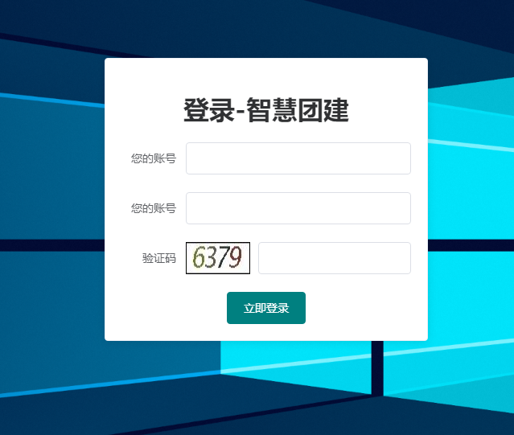
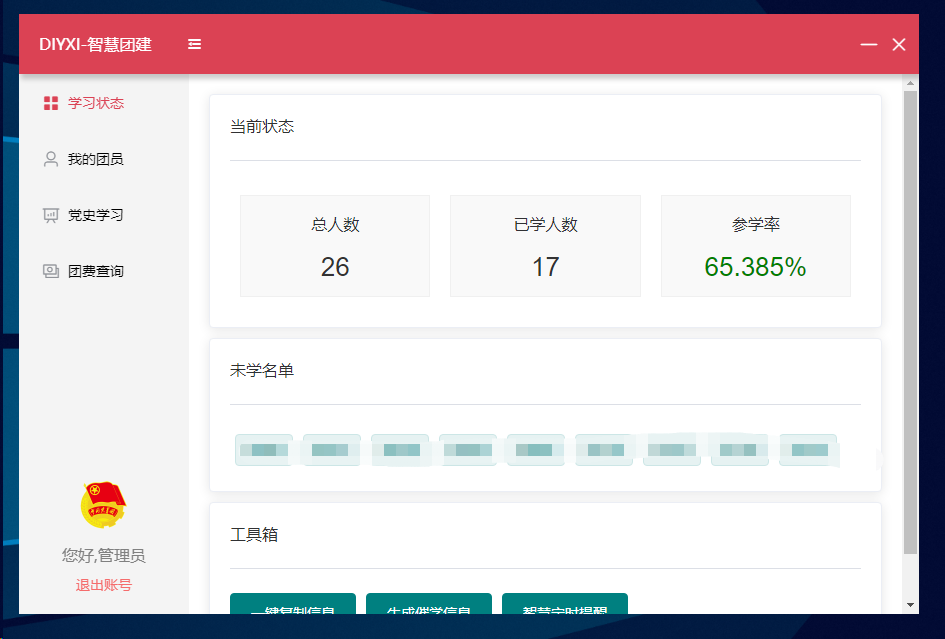
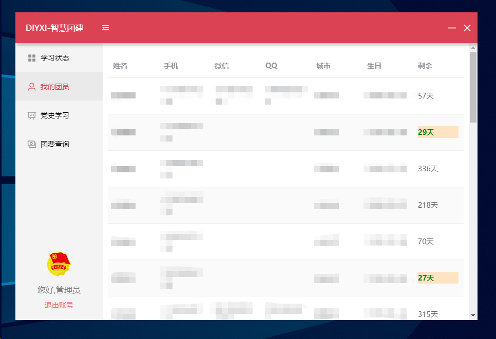
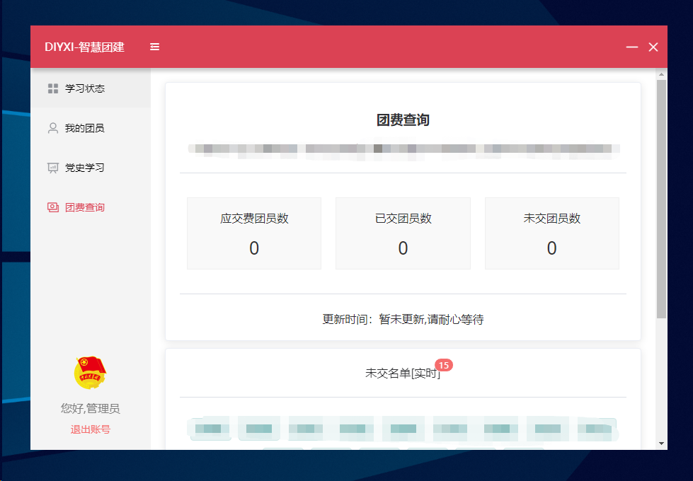
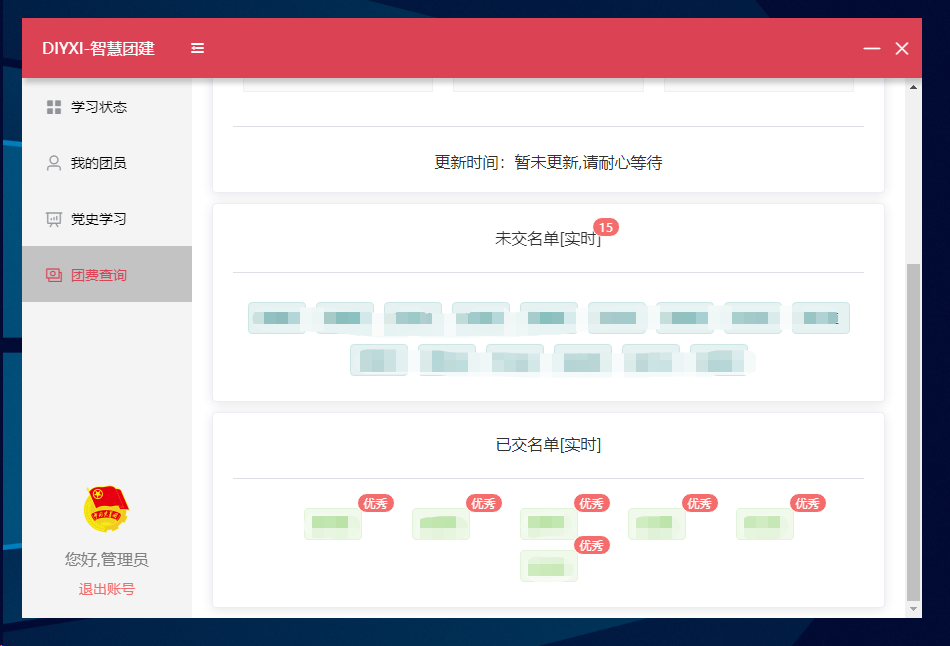

## 广东智慧团建第三方客户端young3.0
这是使用electron开发的广东智慧团建第三方客户端，目的是补全网页版缺失的功能如青年大学习未学名单，优化页面显示效果，优化加载速度等。并且添加一些新的实用性功能。

### 功能展示

#### 登录页面
登录页面输入您的账号密码即可登录，非频繁登录的情况下不需要输入验证码。



#### 学习状态
登录成功后便会进入到主页，默认进入到学习状态，学习状态显示当前青年大学习的状态信息，并给出具体未参学名单。

除此之外，还提供工具箱，分别有【一键复制信息】【生成催学信息】两个功能。

【一键复制信息】功能，就是把当前总人数、已学人数、参学率及未学名单进行合并成一句话并自动复制。

【生成催学信息】功能，就是把参学率及未学名单进行合并成一段催促学生学习的话并自动复制。



#### 我的团员
此处我的团员相对于网页版来说，为了能够尽快联系到同学，显示每一位团员的微信、QQ、电话。并贴心的提供了生日倒计时，小于30天的将会标注出来，方便团支书开展团日活动。



#### 团费查询
团费查询相对于网页版来说，做了UI和布局优化设计，头部显示当前全部状态，但是有更新时间，下面则会显示具体的已交名单和未交名单，已交名单将会在其名字上标注【优秀】以此来激励同学们尽早交团费。





以上仅为示例，未来新增功能及样式外观改变可能不会替换图片。

### 构建项目

本项目只有前端，您只需要按照一定的步骤即可完成项目部署。

## Project setup
```javascript
npm install
```

### Compiles and hot-reloads for development
```javascript
npm run electron:serve
```

### Compiles and minifies for production
```javascript
npm run electron:build
```

### 发行版本
预计8月10日左右将会提供发行版，安装包大小约50MB，压缩包大小约为80MB。

### 贡献
如果你也是一位团支书，也懂得编程，欢迎您贡献~

### 计划
如果你是一位团支书，在工作上您还想如何便利，均可提出Issues，我将会查看。你的想法或许能够实现。

### 声明
本系统仅供学习参考使用，请在下载后24小时内删除，请勿安装下载渠道来历不明的软件，因本软件是开源软件，为了确保安全，请在本页面下载或者去blog.diyxi.top下载，或者您可以选择自己构建和打包。

### gitee链接

[https://gitee.com/huang_jianxi/tuan12355-thirdParty](https://gitee.com/huang_jianxi/tuan12355-thirdParty)
