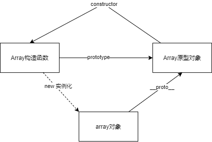
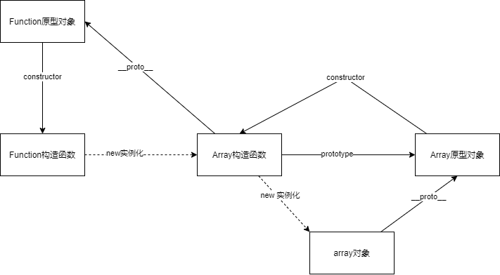
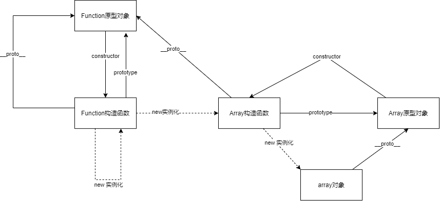
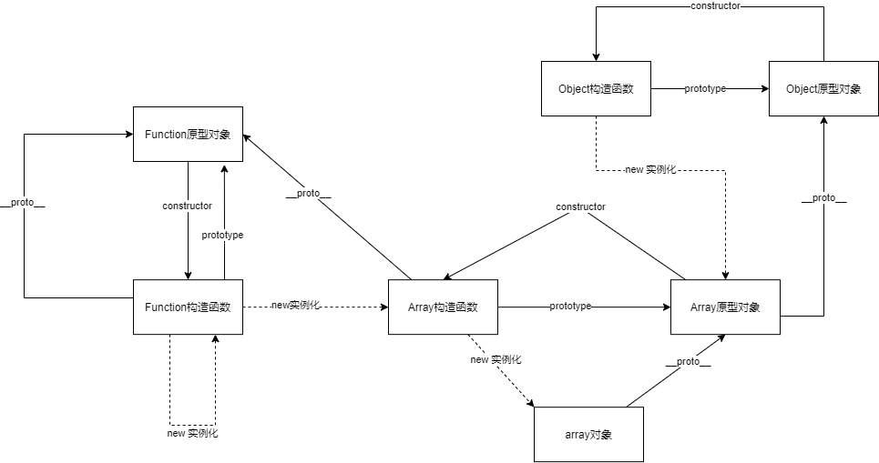
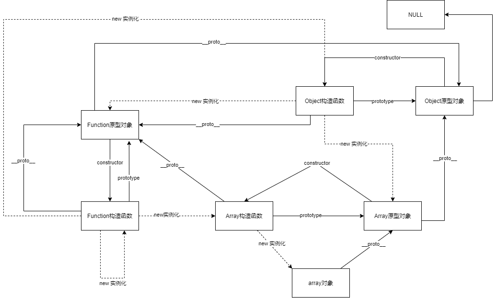

## 前言
1. 本篇博客因篇幅有限，仅提取出个人认为十分重要且有用的精华，由于本人能力有限，文章可能未能一一提及，仅供各位同学参考学习。

2. 本文章所有代码已在WebMaker上有代码测试用例。请点击[略解《JavaScript语言精粹》代码片段](https://webmaker.diyxi.top/#/editor?id=151)访问配合学习。

## 函数

### 函数对象
JavaScript的函数就是对象。每个函数在创建的时候会附加两个隐藏属性：函数的上下文和实现函数行为的代码。

附属资料：[理解JavaScript函数是一等公民](#原型)

### 函数字面量
函数可以通过函数字面量来创建。
```javascript
let add = function(a,b) {
  return a + b
}
```
### 调用方式
#### 方法调用模式
当一个函数被保存为对象的一个属性时候，我们称他为方法。
```javascript
let http = {
  url: '',
  get: ()=>{
    console.log("get方法")
  }
}
```
方法可以使用this访问自己所属的对象。

#### 函数调用模式
当一个函数并非一个对象的属性时，那么它就是被当作一个函数来调用的。
```javascript
let sum = add(3,4)
```
this指向的是全局对象。这是一个语言设计上的错误，正确的设计应该是当内部函数调用的时候this应该仍然绑定到外部函数的this变量而不是全局对象。

因此我们在ES6之前，大多数都是使用let that = this去访问外部函数的this。

```javascript
var state = {
    value: 1,
    add: function() {
        let that = this
        const addNum = function (){
            that.value++
        }
        addNum()
    }
}
state.add()
console.log(state.value)
```
ES6之后，有了箭头函数，现箭头函数完全修复了this的指向，this总是指向词法作用域，也就是外层调用者。

```javascript
const state = {
    value: 1,
    add: function() {
        const addNum = ()=>{
            this.value++
        }
        addNum()
    }
}
state.add()
console.log(state.value)
```
#### 构造器调用模式
1. 使用 new 引导构造函数, 创建了一个实例对象
2. 在创建对象的同时, 将this指向这个刚刚创建的对象
3. 在构造函数中, 不需要 return , 会默认的 return this
4. return 非对象全部失效 return 其他对象, 返回 return 后面的对象

不推荐使用这种形式的构造器函数，如果调用构造器函数时没有在前面加上new，回发生错误！
```javascript
var Status = function (status) {
    this.status = status
}

Status.prototype.get_status = function () {
    return this.status
}

let myStatus = new Status('200')

console.log(myStatus.get_status())
```
#### Apply调用模式
函数可以拥有方法，apply方法让我们构建一个参数数组传递给调用函数，它也允许使用this的值，apply接受两个参数，第一个是绑定this的值，第二个是参数数组。

```javascript
// 修改this指向
let state = {
    name: 'xiaoxi'
}
let fun = function() {
    console.log(this.name)
}
fun.apply(state)
// 传递参数
let state2 = {
    name: 'xiaoxi'
}
let fun2 = function(str,str2) {
    console.log(str + this.name + str2)
}
fun2.apply(state,['我是','，收到请回复'])
```
除apply之外还有call、bind能够实现改变this对象。
1. bind 返回的是一个新的函数，你必须调用它才会被执行。
2. bind和call 的参数是直接放进去的参数用逗号分开。
3. apply 的所有参数都必须放在一个数组里面传进去。
4. call 和 apply 都是立即执行。

[JavaScript 中 call()、apply()、bind() 的用法](https://www.runoob.com/w3cnote/js-call-apply-bind.html)

### 参数

函数被调用的时候会得到一个arguments数组，函数可以通过访问此数组得到所有调用它传递的参数列表，包括没有分配的、未定义的参数。

因为语言的设计错误，arguments并非是一个真正的数组，而是类数组，只有length长度属性，没有数组的方法。

### 闭包

闭包 我们在bing搜索上会得到一句话：能够读取其他函数内部变量的函数。相信很多同学（包括我）应该马上就会理解并跳过，但是我们其实可以深入了解一下为什么要叫闭包？对谁封闭？什么是包？

作用域可以使内部函数访问到外部函数的变量，闭包则是一种有趣的场景，内部函数的生命周期比外部函数的生命周期长，通过调用一个函数的初始化，该函数返回一个对象字面量，并且在内部定义了一个变量，该变量对对象字面量里面的方法可见，但函数的作用域对其他地方的程序是不可见的。

**结论：函数的内部变量对其他地方的程序封闭，包指的是函数返回的对象字面量，且对象字面量中的方法对函数的内部变量可见，总称闭包。**

```javascript
const fun = function() {
    // 函数内部变量
    let value =  1
    // 包我们可以理解为 {} 包起来的，这种实际上叫对象字面量
    const bao = {
        get:function(){
            return value;
        },
        set:function(val){
            value  = val
        }
    }
    return bao
}

const myFun = fun()
console.log(myFun.get())
myFun.set(2)
console.log(myFun.get(2))
// 无法访问
console.log(myFun.value)
// 无法访问
console.log(fun.value)
```
如果对闭包感兴趣您可以点击[闭包更加详细的解释](https://developer.mozilla.org/zh-CN/docs/Web/JavaScript/Closures)

### 级联

有些方法没有返回值此时我们可以返回this就可以启用级联，java高级工程师会把这样的操作称为链式调用。

#### 写法1 - 对象字面量
```javascript
const state = {
    value: 1,
    add: function(val) {
        const addNum = (val)=>{
            this.value = this.value + val
        }
        addNum(val)
        return this
    },
    min: function(val) {
        const addNum = (val)=>{
            this.value = this.value - val
        }
        addNum(val)
        return this
    }
}
state.add(1)
console.log(state.value)
state.add(2).add(3).min(4).add(1).add(3)
console.log(state.value)
```
#### 写法2 - 闭包
```javascript
const fun = function() {
    // 函数内部变量
    let value =  1
    // 包我们可以理解为 {} 包起来的，这种实际上叫对象字面量
    const bao = {
        get:function(){
            return value;
        },
        add:function(val){
            value  = value + val
            return this
        },
        min:function(val){
            value  = value - val
            return this
        }
    }
    return bao
}

const myFun = fun()

myFun.add(2).min(3).add(5)

console.log(myFun.get())
```
还有网上比较容易查到的原型链方式这里就不再列出，可以点击文章顶部的链接进行查看。

### 柯里化

柯里化允许我们把函数与传递给他的参数相结合，产生一个新的函数。

```javascript
// 支持多参数传递
function curry(fn) {
    const curried = (...rest) =>{
        console.log(rest)
        if(rest.length < fn.length) {
            return (...rest2) => {
                return curried(...[...rest,...rest2])
            }
        } else {
            fn(...rest)
        }
    }
    return curried
}
function add (a,b,c) {
    console.log(a+b+c)
}
const curryAdd = curry(add)
curryAdd(1)(3)(4)
```
```javascript
// 实现一个add方法，使计算结果能够满足如下预期：
// add(1)(2)(3) = 6;
// add(1, 2, 3)(4) = 10;
// add(1)(2)(3)(4)(5) = 15;

const add =  (...rest)=> {
    const args = [...rest]
    const adder =(...rest) =>{
        args.push(...rest)
        return adder
    }
    adder.toString =  ()=> {
        return args.reduce(function (a, b) {
            return a + b
        })
    }
    return adder
}

console.log(add(1)(2)(3))
```
### 记忆

函数可以将先前的操作结果记录到某个对象里面，从而避免无谓的重复计算。通常也可以叫做缓存。

```javascript
function fibnan(n) {
        const memo = [0, 1]; // 缓存计算结果
        const fib = (n) => {
          if (memo[n] != null) { // 如果已经被计算就返回他
            return memo[n];
          }
          return (memo[n] = fib(n - 1, memo) + fib(n - 2, memo));  // 否则将他计算加入缓存
        };
        return fib;
      }
```

### 总结

通过上列的学习，我们了解了函数的各大调用方法以及函数的一些特性，包括我们对闭包的理解和使用更加透彻，同时也学会了一些函数的高级用法。

1. 三种调用方式：方法、函数、构造器
2. 四种高级函数使用：级联、柯里化、记忆、闭包

## 原型

### 原型 Prototype
1. 每个对象都连接到一个原型，并且从中继承属性，所有通过对象字面量（一个对象字面量就是包围在一对花括号中的键值对。）创建的对象都连接到Object.prototype。

2. 当创建一个新对象，可以选择某个对象作为它的原型。

```javascript
    Object.create = function (o){
        var F = function (){};
        F.prototype = o;
        return new F()
    }
```
3. 当我们对某个对象做出改变时，不回触及该对象原型，原型连接只有在检索值的时候才会被用到，如果我们尝试去获取对象的某个属性值，但该对象没有此属性名，那么**JS会试着从原型对象中获取属性值**，如果那个原型对象也没有该属性，那么再从它的原型中找，以此类推，直到该过程最后到达终点Object.prototype。如果想要的属性完全不存在于原型链中，那么结果就是undefined值。这个过程成为“委托”。原型关系是一种动态的关系。**如果我们添加一个新的属性到原型中，该属性会立即对所有基于该原型创建的对象可见。**

### 剖析原型及原型链
1. 假设我们new一个数组，通过__proto__可以得到该对象的原型对象，原型对象通过constructor可以得到实例化对象本身的构造函数，而构造函数本身又可以通过prototype拿到原型对象。

```javascript
let arr = new Array()
// 通过__proto__可以拿到Array的原型对象
console.log(arr.__proto__ === Array.prototype) // true
// 通过原型对象的constructor可以拿到构造函数本身
console.log(arr.__proto__.constructor === Array) // true
```
- Array构造函数通过new实例化出array对象
- array对象的__proto__指向Array的原型对象
- Array原型对象的constructor属性可以得到实例化对象本身的构造函数Array
- Array构造函数的prototype又指向该构造函数的原型对象




#### Array的构造函数的原型
Array的构造函数的原型又是谁呢？**函数本身也是一种对象，指向Function原型对象**。**Function原型对象的constructor指向Function构造函数**，所以Array构造函数是由Function构造函数实例化来的。


#### Function构造函数的原型
Function构造函数的原型又是谁呢？我们可以打印一下Function的原型对象__proto__。发现Function的原型对象还是Function并且Function构造函数是由Function构造函数本身实例化而来的。
```javascript
let a = new Function()
console.log(a.__proto__)
console.log(a.__proto__.constructor)
```



Function构造函数已经到达顶端了，用大白话讲，所有构造函数的顶头上司都是Function构造函数，其他构造函数都是老大Function实例化出来的。

#### 什么产生的Array原型对象
什么产生的Array原型对象？

我们可以打印一下Array原型对象的原型对象。发现是Object！Array构造函数的原型对象是通过Object构造函数实例化出来的。
```javascript
let a = new Array()
console.log(typeof a.__proto__.__proto__)
```

#### Object构造函数是谁创造的呢？
Object构造函数是谁创造的呢？

所有构造函数的顶头上司都是Function构造函数，那么Object构造函数就是Function构造函数实例化出来的。不信我们可以打印一下。

```javascript
console.log(typeof Object.prototype)
console.log(typeof Object.constructor.prototype)
```



此时我冒出了一个疑问，是先有Object原型对象还是先有Function原型对象？

### JS 究竟是先有鸡还是有蛋

我们常说JavaScript中函数是一等公民，这是因为函数扮演了创造万物的角色，原始构造函数Function创造了function fn(){}（ES5中函数与构造函数并无区别）、Object()、Array()、Number()、String()等诸多构造函数，而构造函数也拥有创造对应实例对象的能力，比如Array()生产数组，String()生产字符串，你会发现JavaScript中绝大多数的数据类型，都能找到创造自己的构造函数，所以说函数是一等公民不无道理。
#### 几个疑问
1. 如果说Function()扮演着创世主的角色，那Function.prototype不应该是仅次于原型链顶端null的存在吗？
2. 在我们绘画原型链的图过程中，我们知道紧接在null之下的是Object.prototype，Object.prototype的起源地位似乎比Function.prototype更早，那Object.__proto__ === Function.prototype又是怎么回事？Object与Function到底谁的起源更早，谁才是真正的创世主？

#### 起源
盘古开天辟地，js 中并不是就有了 `Object`构造函数，而是 `Object.prototype`Object原型对象。

所以，`Object.prototype`原型对象 先于 `Object`构造函数 出现，然后用这个 `prototype`原型对象 构造出 `Function.prototype`原型对象，有了 `Function.prototype`原型对象 再构造出 `Function`构造函数 ， `Object`构造函数  这几个构造器。然后把 `Object.prototype`原型对象 挂到 `Object`构造函数  上，`Function.prototype`原型对象 挂到`Function`构造函数 上。

所以，是先有的 `Object.prototype`,再有的 `Function.prototype` ，再有的 `Function` 和` Object`。

### 总结

通过上面我们深刻认识到原型及原型链的知识，以前刷面试题的时候总是很粗浅的了解很少深入了解到其中的奥秘，比如像原型链我们最多就知道原型链的顶端是Object，Object的顶端是NULL，function是一等公民等，可是我们仿佛是背诵或者强行自己理解一样并没有领悟原型和原型链的真正的构造，当我把上面的图画出来的时候，原型链的迷雾就已经被拨开，本章总结如下：

1. 先有了Object原型对象，
2. 然后有Function原型对象，
3. 然后有了Function构造函数，
4. 然后创建了Object构造函数，
5. Object构造函数.prototype又指向了Object的原型，构成了循环指向；


可以说先有`Function`构造函数再有`Object`构造函数。也可以说先有的`Object`原型，再有的`Function`原型。Object.prototype.__proto__ === null，说明原型链到Object.prototype终止。原型链的顶端可以说是Object也可以说是null，看你个人定义。
