## 1 下载与安装

访问官方下载地址：[https://drawthings.ai/](https://drawthings.ai/) 获取 Draw Things App 并安装到 Mac。安装过程简单，只需将应用程序拖拽到 Applications 文件夹即可。

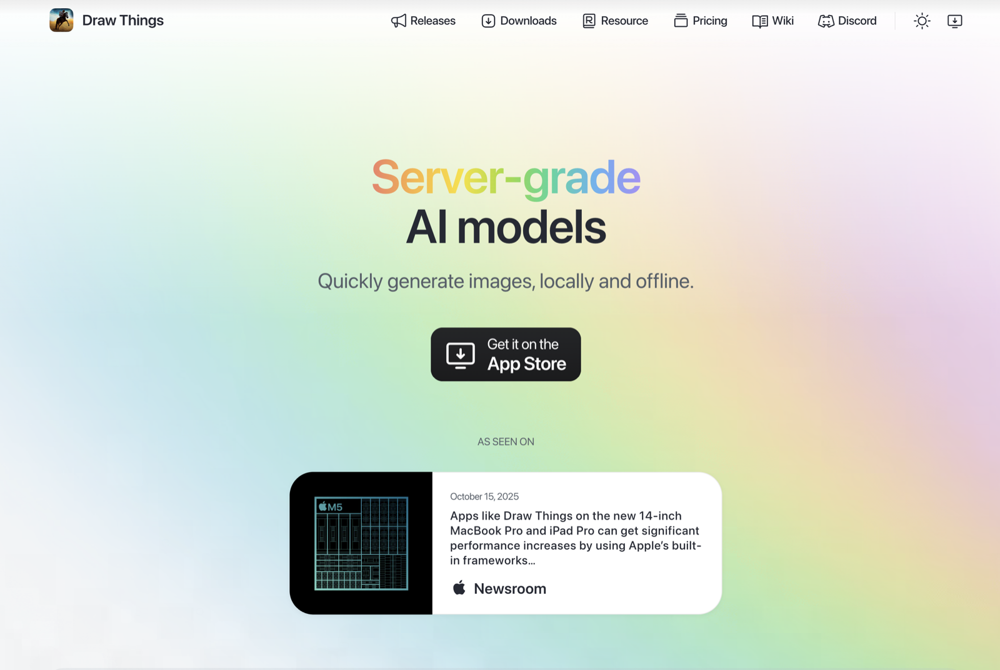

## 2 参考环境配置

本次教程实践的电脑配置是：

| 配置项 | 详细参数 | 说明 |
| --- | --- | --- |
| **处理器** | Apple M5 | 10 核心（6 个能效核心 + 4 个超级核心），10 线程 |
| **内存** | 24 GB | 足够运行大型 AI 模型 |
| **图形** | Apple M5 (10 核心) | 集成 GPU，支持 AI 绘图加速 |
| **存储** | Macintosh HD (994.61GB) | 充足的存储空间 |
| **系统** | macOS Sonoma (14.5.2) | 最新操作系统版本 |

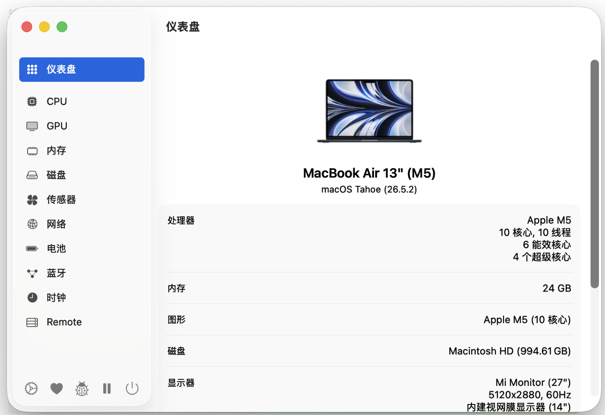

**如果你是 16 GB 内存不用担心，也可以跑起来的；8 GB 内存比较憋屈，跑 FP4 量化也需要加载大约 4 GB 内容到内存，可以进行尝试。**

## 3 创建项目

打开 Draw Things 应用程序后，进入主页面点击「创建项目」按钮，系统会自动初始化一个新的绘图项目。如下图所示，点击创建项目按钮。

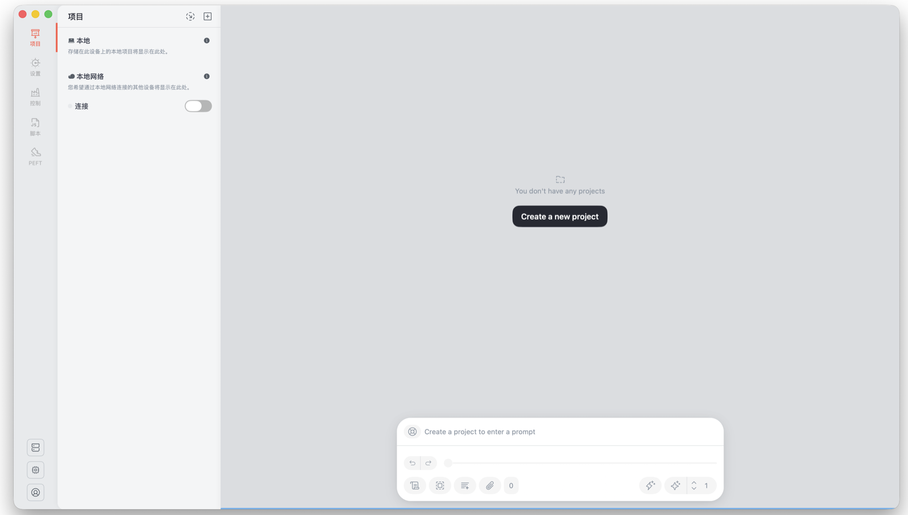

## 4 模型选择

### 4.1 模型划分

此时就可以进入到设置页面，在模型处下载所需模型。模型有以下划分：

| 分类方式 | 模型类型 | 特点描述 |
| --- | --- | --- |
| **按类型划分** | Checkpoint（主模型） | AI 绘图的核心引擎，体积较大（2–7GB），决定了作品的基础风格和特征 |
|  | LoRA（小型加性模型） | 体积较小（几十 MB 到几百 MB），主要用于调整主模型的特定训练方向，如风格、细节等 |
| **按功能划分** | 图像生成模型 | 专注于 Text to Image（文生图），通过文本描述生成全新图像；对局部修改（如去眼镜、换衣服）有局限 |
|  | 图像编辑模型 | 具备 Inpainting 与图像编辑能力，类似 Photoshop 的局部修改逻辑 |

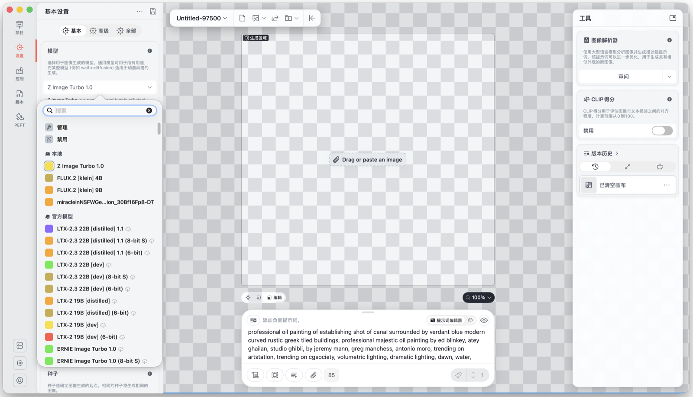

Draw Things 内置了多种预置模型，结合自身的 MacBook 配置，选择对应的模型。

### 4.2 模型推荐

**图像生成模型：**

推荐使用 **Z Image Turbo 1.0**。该模型约 6B 参数，**在 16 GB 显存的显卡上跑 Z-Image Turbo 1.0（BF16）是比较稳妥的配置**。更低显存也能跑，但需要 CPU offload / 量化 / 降低分辨率等优化，体验会明显变慢。

**图像编辑模型：**

推荐使用 **FLUX.2 [klein]**。该模型约 9B 参数，**在 24 GB 显存上跑比较稳妥**。配置较低时可以选择 FLUX.2 [klein] 4B 版本。

## 5 图片生成

### 5.1 图像生成模型 Z Image Turbo 1.0 效果

以下是在我本地实测跑出来的图片。效果还行，大约 30 秒即可完成生成，占用也不夸张。


### 5.2 图像编辑模型 FLUX.2 [klein] 效果

以下是本地使用 9B 参数模型实测的结果。以下面这位女孩为例，把她的眼镜去掉。

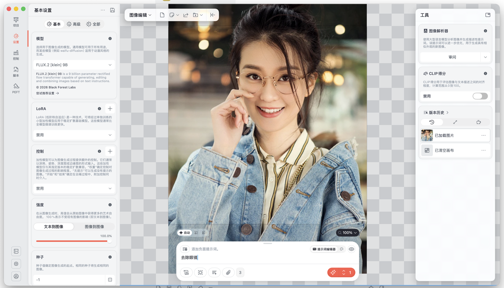

效果还行，运行时间大约 30 秒。

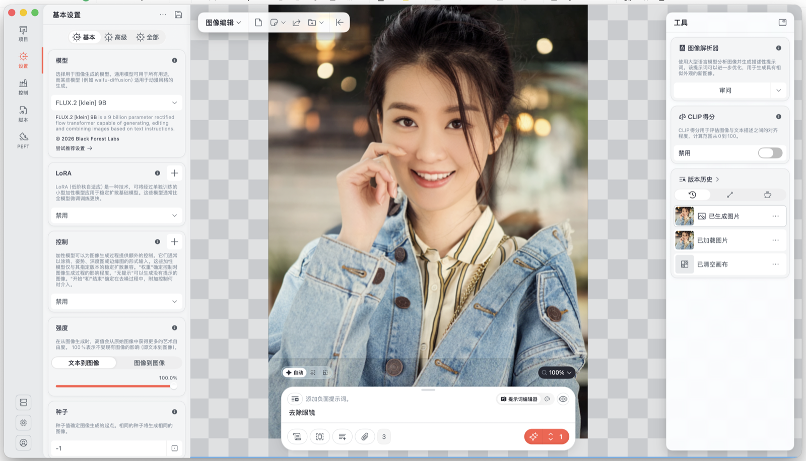

还可以改别的，例如换衣服：基于上图继续编辑，把衣着换成校服。由于没有把整张图都放进编辑区域，**只有编辑区域内的部分会被 AI 处理**；分辨率和缩放可以根据机器配置自行调整。

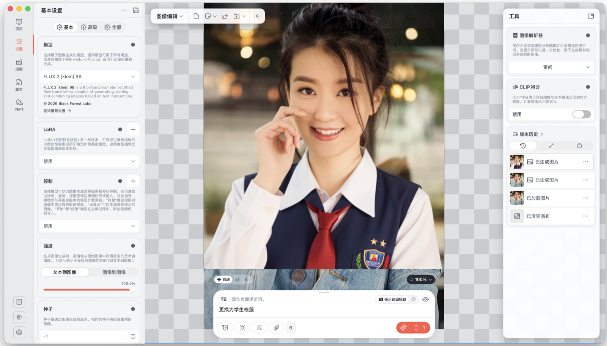

还可以编辑更多内容，发挥你的想象。~~**当然！我知道你在想什么，你想 X 衣？**~~

FLUX.2-klein-9B 原生开源模型在本地是无法生成 X 衣这类图片的，原因大致是：

1. 开发团队在训练数据中提前筛除了色情、暴力等内容，模型未学习如何生成这类图像；
2. 训练后还会用大量「钻空子」提示词做对抗性微调，进一步抑制相关概念。

因此 FLUX.2-klein-9B 原生开源模型没有办法生成 X 衣这类图片。

## 6 LoRA：小型加性模型

刚刚提到模型分为主模型和小型加性模型，本章单独介绍后者。

LoRA（低秩适应）是一种轻量级大模型微调方法：通过添加低秩矩阵模块适配特定任务，无需修改原始模型。资源需求低、性能接近全量微调、模块小巧灵活，适用于大语言模型、扩散模型等场景，用很少参数就能让模型学会新任务。

主要能力包括：

| 功能类别 | 具体说明 |
| --- | --- |
| **风格定制** | 生成特定艺术风格（赛博朋克、水墨、油画、像素风、复古、未来主义等） |
| **角色生成** | 定制角色外观（动漫 / 真人 / 幻想生物的发型、服装、面部细节等） |
| **画风模仿** | 模仿特定画师（如宫崎骏、新海诚、某插画家）或艺术流派 |
| **元素添加** | 注入特定物体、场景或细节（建筑、动物、道具、纹理等） |
| **混合风格** | 结合多个 LoRA（如「赛博朋克 + 水墨」「日式 + 科幻」） |
| **细节调整** | 控制眼睛形状、皮肤质感、服装纹理等 |
| **多任务适配** | 同一基座适配多任务（人物 + 场景、静物 + 背景等） |
| **快速迭代** | 无需重训主模型，快速试风格与参数 |
| **资源高效** | 文件通常几十 MB，低显存占用，适合个人设备 |
| **共享与复用** | 方便分享 LoRA，他人可直接加载 |
| **NSFW** | — |

> 悄悄说：LoRA NSFW 理论上可以缓解 5.2 的限制，但效果一般；实测里 LoRA 与主模型经常「打架」，最后仍可能生成不出来。

以 **LOGO-REDMOND-ZIMAGETURBO** 为例：这是面向专业 Logo 的特调 LoRA。下载时在网站右侧点 **Use this model**，选择 Draw Things 即可。

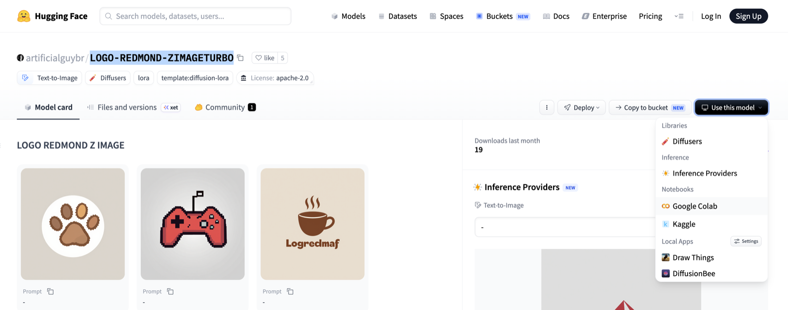

LoRA 通常体积不大，点击后会唤起 Draw Things 的导入对话框。

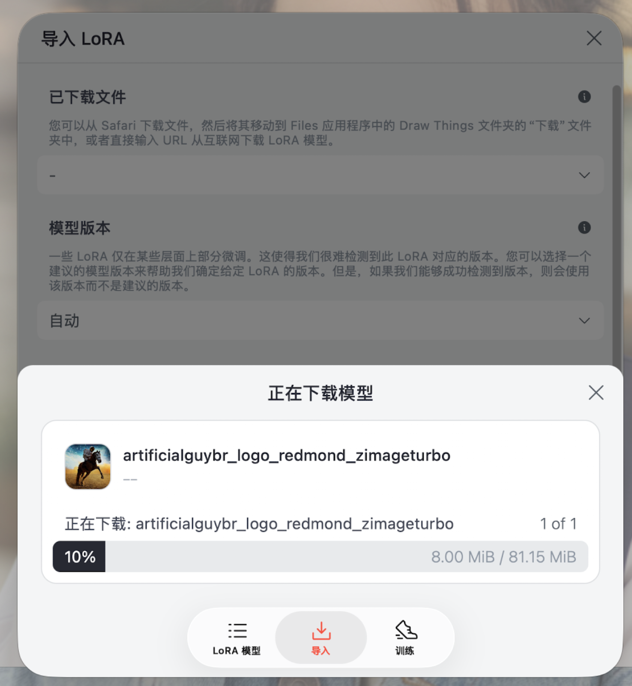

模型版本需要选对：Z Image Turbo 对应选 Z Image。

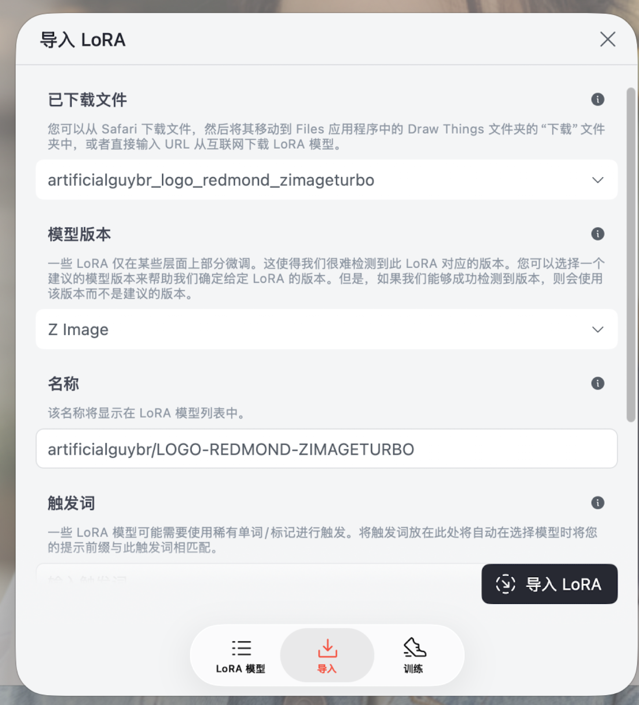

在左侧选择要加载的 LoRA（可以叠多个）。这里只加载 logo 这一个。

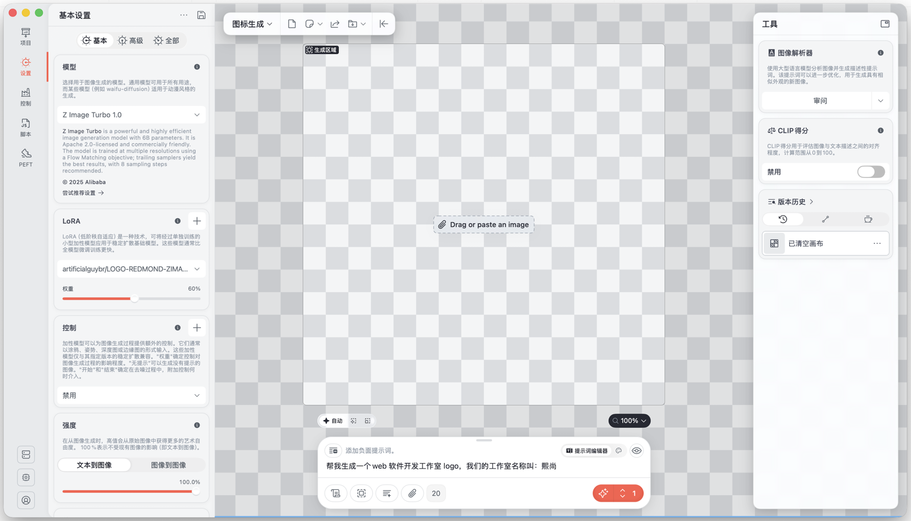

额，这个特调生成得有点丑，怪不得下载量这么低……

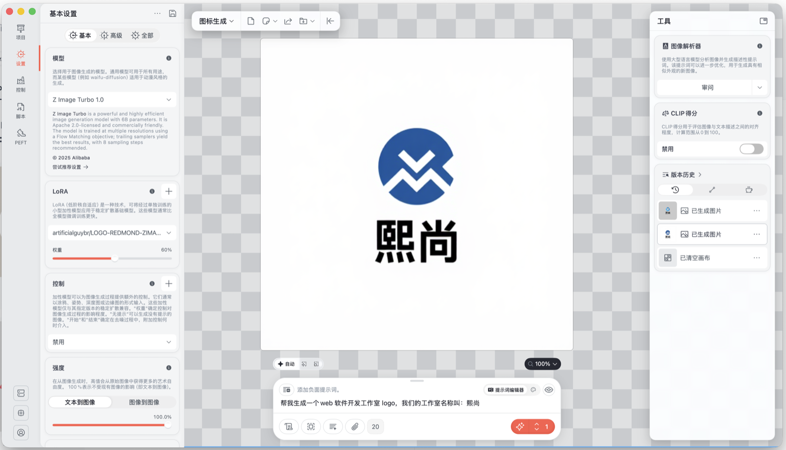

再试 **aimaginedworlds**（偏动漫 / 插画风格的 LoRA），这次效果不错。

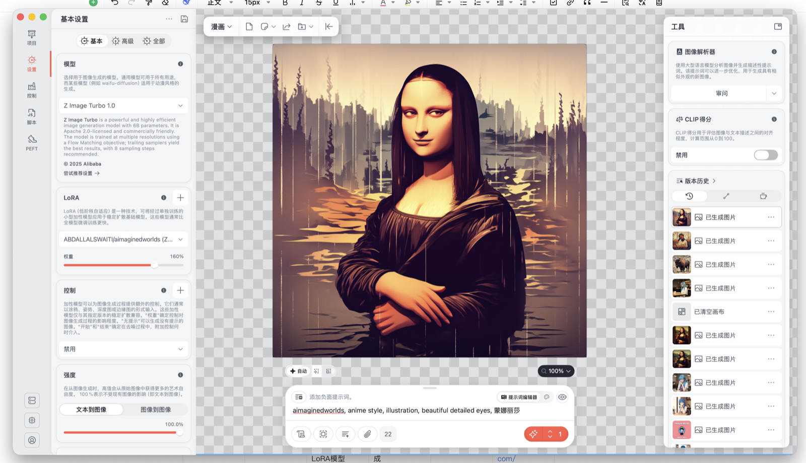

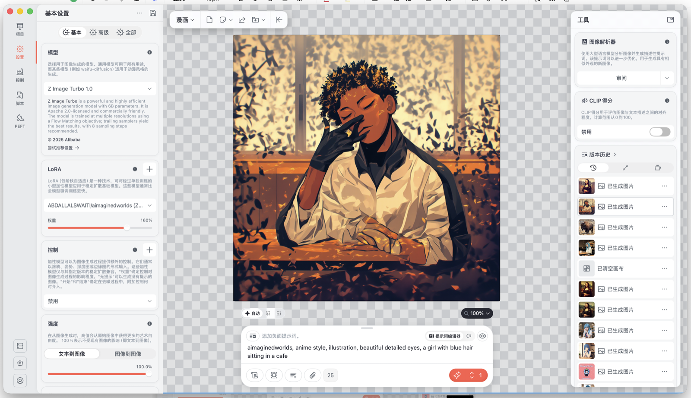

大概就这样演示了 LoRA 的用途，风格、场景等可以自己继续挖。

## 7 模型市场

除了 Draw Things 内置模型，还支持从以下平台导入：

| 平台名称 | 所属公司/组织 | 主要特点 | 适用领域 | 语言支持 | 访问方式 |
| --- | --- | --- | --- | --- | --- |
| **Hugging Face Model Hub** | Hugging Face | 全球最大开源模型库，社区活跃 | NLP、CV、音频、多模态 | 多语言 | [huggingface.co/models](https://huggingface.co/models) |
| **Civitai** | Civitai | 专注 AI 绘画与 LoRA | AI 绘画、图像生成 | 英文为主 | [civitai.com](https://civitai.com/) |
| **ModelScope / 魔搭** | 阿里巴巴 | 中文模型丰富，企业向 | 多模态、中文 NLP/CV | 中文为主 | [modelscope.cn](https://modelscope.cn/) |
| **百炼** | 百度 | 文心系列，集成百度生态 | 中文 NLP、CV | 中文 | [百度智能云](https://cloud.baidu.com/product/wenxin) |

例如 Civitai 上常有个人训练的特调模型，但直接下载有时**无法导入 Draw Things**。通过排查，常见原因是：

1. safetensors 文件 header 不兼容；
2. tensor 命名不匹配（尤其是 `key_norm.weight` / `query_norm.weight` 应改为 `.scale`）；
3. 很多 Civitai 模型是 ComfyUI 导出的 FP8，Draw Things 直接读不了。

网上有两个修复脚本：

1. 简单修复：`fix-safetensors-header.py`（覆盖大部分情况）
2. 高级修复：`flux2-klein-draw-things.py`（专修 Flux.2 相关）

用法类似：

```bash
python3 fix-safetensors-header.py xxxx.safetensors
python3 flux2-klein-draw-things.py xxxx.safetensors
```

我在 Civitai 下过 Flux.2 Klein 特调：简单脚本修完仍导不进，必须用高级脚本后才能正常导入。嫌麻烦也可以上 ComfyUI，但当前笔记本内存、性能、散热都偏紧，个人觉得暂时没必要。

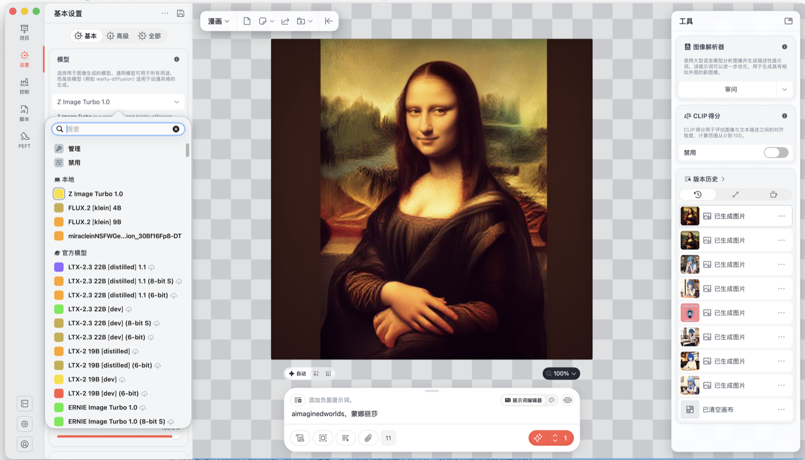

自由市场里模型很多（含 NSFW），更多的就自行探索吧。
