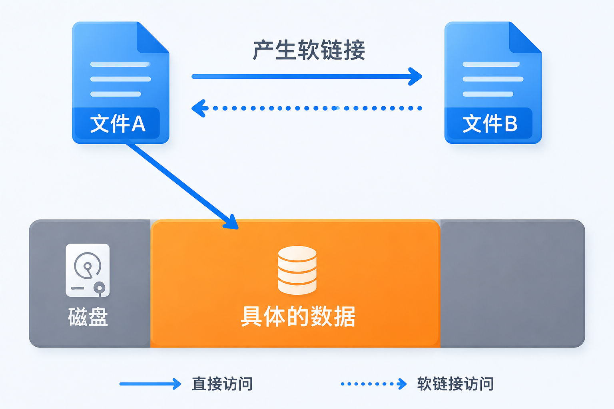
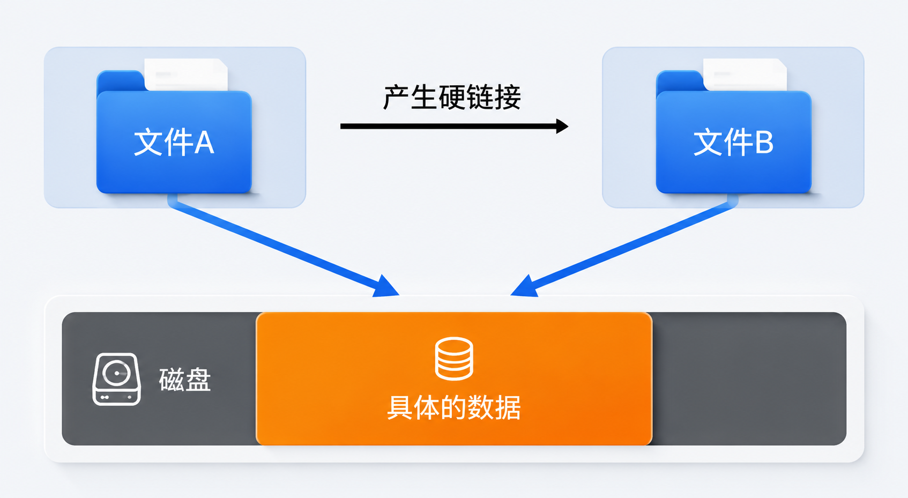
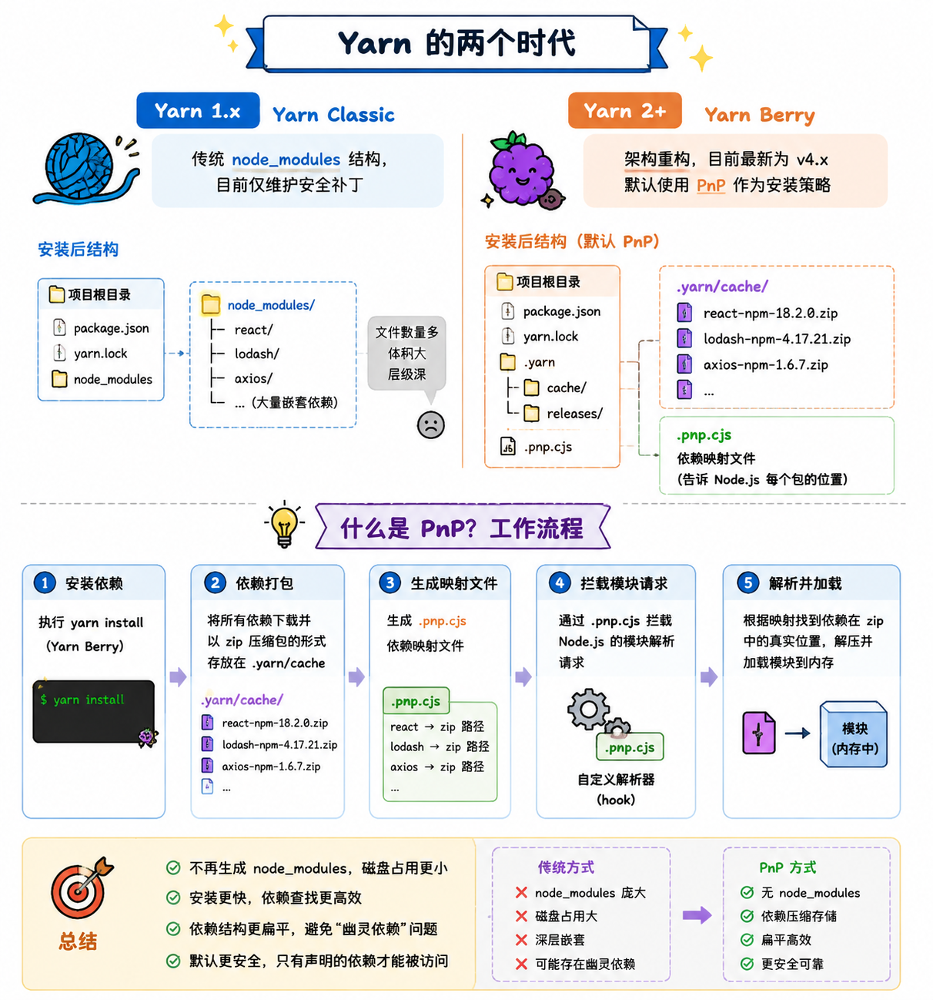

## npm

在 npm 早期版本（尤其是 npm 2 及以前）存在以下问题：

- **依赖目录嵌套层次深**：Windows 系统路径长度限制导致安装失败
- **下载速度慢**：依赖只能串行下载，带宽利用率低
- **相同版本包重复下载**：多个项目各自保存一份
- **控制台输出繁杂**：安装过程信息过多，难以定位错误
- **工程移植问题**：版本范围模糊，导致不同机器安装出不同版本

npm 在后续版本中大幅改进：

- npm 3 开始采用**扁平化** `node_modules` 结构；
- 引入并行下载与本地缓存；
- npm 7 正式支持 **workspaces**（Monorepo）；
- 使用 `package-lock.json` 保证依赖确定性；
- **npm 12**（2026 年）加强了安全默认策略：
  - 默认禁止执行依赖的 lifecycle scripts；
  - 默认禁止 git 依赖和远程 tarball 依赖；

## pnpm

pnpm 是新的包管理工具，它具有以下优势：

- 安装效率高；
- 极简的 `node_modules` 目录；
- 避免开发时使用了幽灵依赖；
- 能够极大降低产品空间占用；

### pnpm 原理

- 和 yarn、npm 一样，pnpm 依然使用缓存来保存已经安装过的包，以及使用 lock 文件详细记录依赖版本；
- 不同于 yarn、npm，pnpm 使用**符号链接和硬链接**来放置依赖，从而避免了从缓存中拷贝文件，使得安装和卸载飞快。其实这个和当前 skills 管理也是一致的，不同的 agent 存放的目录不一样，就会创建**符号链接**进行快速引用文件。
- 由于使用了符号链接和硬链接，pnpm 可以规避 Windows 操作系统路径过长的问题，因此其采用**树形依赖展示依赖关系，项目中只能访问直接依赖，而不能使用幽灵依赖**，幽灵依赖会安装在对应依赖的目录下方。

### 现阶段可能存在的问题

由于 pnpm 改造了 `node_modules` 的目录结构，使得每个包都只能使用直接依赖，而不能使用幽灵依赖，因此如果使用 pnpm 安装的包代码不规范、使用了幽灵依赖，则会导致代码报错。随着 pnpm 的超高下载量和问题的发现，越来越多包作者修复了幽灵依赖的问题。

为了解决这个问题，pnpm 也做了一定优化处理：**把所有的非直接依赖全部放到 `.pnpm` 下的 `node_modules`，通过符号链接引用到文件**，以此解决上述幽灵依赖的问题。

### 什么是符号链接（软链接）、硬链接？

符号链接就是软链接，类似于快捷方式，软链接不复制指针，而是直接指向文件 A，如下图所示。

硬链接就是把 A 指针复制到另外一个文件 B 指针，文件 B 就是文件 A 的硬链接，如下图所示。

**符号链接和硬链接的区别：**

1. 硬链接仅能链接文件，而符号链接可以链接目录
2. 硬链接在链接完成后仅和文件内容关联，和之前链接的文件没有任何关系。而符号链接始终和之前链接的文件关联，和文件内容不直接相关。

## yarn

在过去，npm 存在下面的问题：

依赖目录嵌套层次深：过去，npm 的依赖是嵌套的，这在 Windows 系统上是一个极大的问题，由于众所周知的原因，Windows 系统无法支持太深的目录。

- 下载速度慢
- 由于嵌套层次的问题，所以 npm 对包的下载只能是串行的，即前一个包下载完后才会下载下一个包，导致带宽资源没有完全利用
- 多个相同版本的包被重复下载
- 控制台输出繁杂：过去，npm 安装包的时候，每安装一个依赖，就会输出依赖的详细信息，导致一次安装有大量的信息输出到控制台，遇到错误极难查看
- 工程移植问题：由于 npm 的版本依赖可以是模糊的，可能会导致工程移植后，依赖的确切版本不一致。

针对上述问题，yarn 从诞生那天就已经解决，它用到了以下的手段：

- 使用**扁平化的目录结构**
- **并行下载**
- 使用**本地缓存**
- 控制台仅输出关键信息
- 使用 `yarn.lock` 文件记录确切依赖

yarn 的出现给 npm 带来了巨大的压力，很快，npm 学习了 yarn 先进的理论，不断对自身进行优化，从 npm 3 开始到目前的 npm 12 版本，几乎完全解决了上面的问题。npm 6 之后，可以说 npm 已经和 yarn 非常接近，甚至没有差距了。很多新的项目，又重新从 yarn 转回到 npm。

### Yarn 的两个时代

| 版本 | 名称 | 特点 |
| --- | --- | --- |
| Yarn 1.x | **Yarn Classic** | 传统 `node_modules` 结构，目前仅维护安全补丁 |
| Yarn 2+ | **Yarn Berry** | 架构重构，目前最新为 v4.x |

Yarn Berry 的核心特性：PnP（Plug'n'Play）。**PnP 是 Yarn Berry 的默认安装策略。**

#### 什么是 PnP？

传统方式会生成庞大的 `node_modules` 文件夹，而 PnP **不再生成 `node_modules`**，而是：

- 把所有依赖以 **zip 压缩包** 形式存放在 `.yarn/cache`；
- 生成一个 `.pnp.cjs` 映射文件；
- 通过这个文件告诉 Node.js 每个包的实际位置；

#### 运行时如何读取依赖？

Yarn 通过自定义 loader 直接从 zip 包中读取文件，大多数情况下不会真正解压到磁盘。只有遇到 native 模块等特殊情况才会解压（称为 unplug）。

#### PnP 的优势

- 安装速度极快（几乎不需要大量文件复制）
- 磁盘占用更低
- 严格依赖（天然防止幽灵依赖）
- 支持 Zero-Installs（可将依赖缓存提交到 Git）

## 三者对比

| 维度 | **npm 12** | **pnpm 11** | **Yarn Berry 4** |
| --- | --- | --- | --- |
| **安装方式** | Node.js 自带 | 需单独安装 | 需单独安装 |
| **存储模型** | 每项目独立 `node_modules` | 全局内容寻址 + 硬链接 | 默认 PnP（zip + `.pnp.cjs`） |
| **磁盘占用** | 最高 | **最低** | 低（PnP）/ 中等 |
| **安装速度** | 较慢 | **很快** | 很快（尤其 PnP） |
| **幽灵依赖** | 允许 | **默认禁止** | PnP 禁止 / Classic 允许 |
| **Monorepo** | 支持（够用） | **最强** | 很强 |
| **Lockfile** | `package-lock.json` | `pnpm-lock.yaml` | `yarn.lock` |
| **兼容性** | **最好** | 高 | PnP 偶尔有摩擦 |
| **特殊能力** | 零配置、最省心 | 磁盘效率 + 严格依赖 | Zero-Installs、插件系统 |
| **推荐场景** | 新手、简单项目 | **大多数新项目** | 已有 Yarn 工作流、需要 Zero-Installs |

## 总结

- **npm**：最稳妥、兼容性最好，适合不想折腾的场景。
- **Yarn**：从 Classic 到 Berry 完成了架构升级，PnP 是其最大特色，适合有特定工作流需求的团队。
- **pnpm**：目前在速度、磁盘效率和依赖正确性上综合表现最好，已成为很多新项目的默认推荐。

三者差距已经比早年小很多，但 **pnpm 在「效率 + 正确性」上的综合优势**，使其成为 2026 年最常被推荐的选择。
