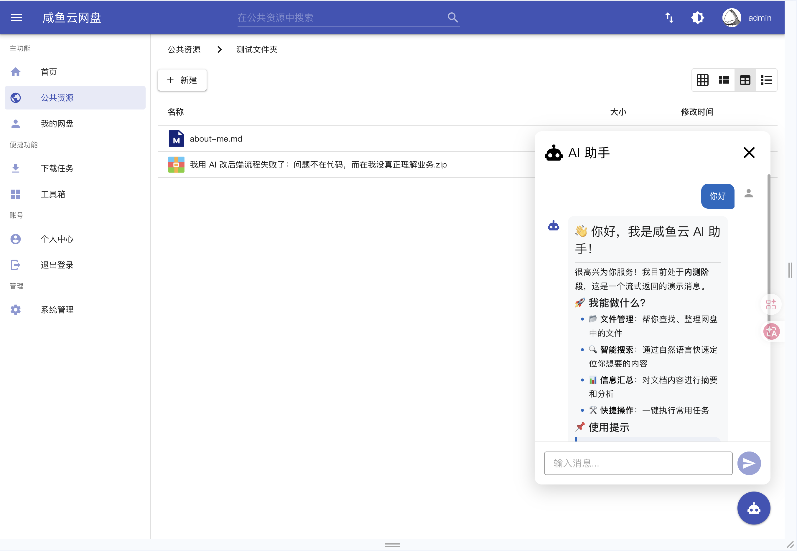

## 背景

最近在咸鱼云项目中接入 AI 助手，需要实现**打字机效果**——后端逐字推送 markdown 内容，前端实时渲染。技术选型上，我们选择了 SSE（Server-Sent Events），原因很简单：单向推送场景下 SSE 比 WebSocket 轻量得多，基于 HTTP 无需额外协议握手，浏览器原生支持 `EventSource`。

架构如下图：

```text
用户输入 → 前端 POST /api/ai-assistant/chat → 后端处理
                                              ↓
   前端 MarkdownView ← 逐字累加 ← SSE stream ← 逐码点推送
```

## 第一个坑：`\n` 去哪了？

后端用 Spring 的 `SseEmitter`，最直观的实现是遍历字符串的每个字符，逐个 `emitter.send()`：

```java
reply.codePoints().forEach(cp -> {
    emitter.send(new String(Character.toChars(cp)), MediaType.TEXT_PLAIN);
    Thread.sleep(20);
});
```

前端用 `@microsoft/fetch-event-source` 接收，通过 `onmessage` 回调逐字拼回完整字符串：

```typescript
onmessage(event) {
    onMessage(event.data)  // 拼到 aiMsg.content 上
}
```

看起来无懈可击。结果测试时发现：**所有换行符凭空消失，markdown 糊成一团**。

`## 标题` 和 `正文` 之间没有段落间隔，打印出来的内容是：

```text
##👋你好...
```

但 Java 源码里明明写着 `"##   👋 你好...\n\n很高兴..."`。空格和换行符去哪了？

## 破案：SSE 协议用 `\n` 做行分隔

想了一晚上才反应过来——**SSE 协议本身用 `\n` 作为行终止符**。一个标准的 SSE 事件在 wire 上是这样的：

```text
data:你好\n\n
```

其中第一个 `\n` 结束 `data:` 行，第二个 `\n` 表示事件结束。问题来了：当你的**数据内容**恰好是 `\n` 时，`SseEmitter` 生成的 wire 格式是：

```text
data:\n\n
```

SSE 解析器读到 `data:` 后遇到 `\n`，认为这一行结束了，data 值是空字符串。接着又一个 `\n`，被解析为事件分隔符——于是 `\n` 这个字符被协议**吞掉了**。后续字符的解析也全部偏移，空格等字符同样受影响。

这正是经典的**数据与控制符冲突**问题——你要传输的字符恰好是协议用来划界的字符。

## 解决方案：给字符穿件数字马甲

既然不能直接传 `\n`，那就给它一个安全的中间表示。每个 Unicode 字符都有一个唯一的十进制码点：

| 字符 | 码点 |
| --- | --- |
| `#` | 35 |
| ` ` | 32 |
| `\n` | 10 |
| `👋` | 128075 |

码点的十进制表示只包含 `0-9` 这十个数字字符，它们在 SSE 协议里没有任何特殊含义。于是我们把传输链路改成：

```text
原始字符 → 十进制码点 → SSE data 字段 → parseInt → String.fromCodePoint → 原始字符
                ↑                                            ↓
           仅含 0-9 数字                                  还原回字符
```

后端改动一行：

```java
// 之前
emitter.send(new String(Character.toChars(cp)), MediaType.TEXT_PLAIN);
// 之后
emitter.send(String.valueOf(cp), MediaType.TEXT_PLAIN);
```

`\n` 的码点是 10，现在 wire 上不再是 `data:\n\n`（歧义），而是 `data:10\n\n`（无歧义）。SSE 解析器安全地把 `"10"` 传给前端，前端用 `String.fromCodePoint(10)` 还原回 `\n`。

前端对应解析：

```typescript
onmessage(event) {
    if (event.data === '[DONE]') {
        // 流结束标记
        return
    }
    const cp = parseInt(event.data, 10)
    if (!isNaN(cp)) {
        onMessage(String.fromCodePoint(cp))
    }
}
```

打油诗概括这个思路：

> SSE 用 `\n` 分界线，你的 `\n` 它看不见；  
> 码点编码穿马甲，0 到 9 安全无挂。

## 第二个坑：SseEmitter 的 MediaType 陷阱

Spring 的 `SseEmitter.send()` 有两个重载：

```java
emitter.send(Object data)                              // 1
emitter.send(Object data, MediaType mediaType)          // 2
```

如果调用 `send(data)` 不指定 MediaType，Spring 会用 `SseEventBuilder` 的默认序列化，生成的 content-type 是 `text/event-stream`。这在大多数场景下没问题。

但在我们的项目中，存在一个自定义的 `RedirectableUrlHttpMessageConverter`，它对非泛型版 `canWrite(Class, MediaType)` 的实现在 mediaType 为 `null` 时错误返回 `true`，导致抢占了 `String` 的写入权，抛出转换异常。

解决方式：显式指定 `MediaType.TEXT_PLAIN`，让 Spring 跳过这个自定义转换器，落到 `StringHttpMessageConverter` 正常写入。

```java
emitter.send(String.valueOf(cp), MediaType.TEXT_PLAIN);
//                        ^^^^^^^^^^^^^^^^^^^^^^^^^ 必须指定
```

## 第三个坑：Nginx 缓冲

SSE 是流式推送，但如果前端有 Nginx 反向代理，默认会对响应做缓冲。SSE 事件被积压到 buffer 满了才一次性推到客户端，打字机效果就变成了段落式输出。

后端需要设置响应头：

```java
response.setHeader("X-Accel-Buffering", "no");
```

这是 Nginx 的扩展头（`X-Accel-*`），通知 Nginx 不要缓冲此响应。虽然非标准，但主流反向代理（Nginx、OpenResty）都支持。

## 第四个坑：线程管理

`SseEmitter` 的发送是阻塞的——每个字符发送后我们 `Thread.sleep(20)` 来制造打字机延迟。如果直接在请求线程里做，会长时间占用 Tomcat 的工作线程。

我们为 SSE 连接配置了独立的线程池，用 `CallerRunsPolicy` 拒绝策略，避免任务被静默丢弃：

```java
private final ExecutorService sseExecutor = new ThreadPoolExecutor(
        4, 32, 60, TimeUnit.SECONDS,
        new SynchronousQueue<>(),
        r -> {
            Thread t = new Thread(r, "ai-assistant-sse");
            t.setDaemon(true);
            return t;
        },
        new ThreadPoolExecutor.CallerRunsPolicy()
);
```

`SynchronousQueue` 保证没有任务积压——提交者必须等待 worker 取走任务，否则阻塞。`CallerRunsPolicy` 在饱和时由调用线程执行，而不是静默丢弃。

## 第五个坑：前端 Vuetify 主题丢失

扩展组件通过 `dyncmount` 挂载到 DOM 上。为了不引入全屏 fixed 覆盖样式，我们设置 `wrapVApp: false`，绕过了 `VApp` 包裹。

问题：Vuetify 4 依赖 `VApp` 来注入主题 CSS 变量（`--v-theme-surface` 等）。没有 `VApp`，Vuetify 子组件拿不到背景色和文字色，呈现黑底黑字。

解决方案：在组件自身 CSS 中手动声明 Vuetify 主题变量：

```css
.ai-dialog {
    --v-theme-surface: 255, 255, 255;
    --v-theme-on-surface: 0, 0, 0;
    --v-theme-surface-variant: 247, 248, 249;
    --v-theme-on-surface-variant: 66, 66, 66;
    --v-theme-primary: 24, 103, 192;
    --v-theme-on-primary: 255, 255, 255;
    --v-theme-background: 255, 255, 255;
    --v-theme-on-background: 0, 0, 0;
    background-color: rgb(var(--v-theme-surface));
    color: rgb(var(--v-theme-on-surface));
}
```

这样即使没有 `VApp`，子组件也能通过 `var(--v-theme-xxx)` 取到正确的颜色值。

## 总结

SSE 看似简单，但接入过程中这些坑层层嵌套：

1. **协议与数据的冲突** — 数据 `\n` 与 SSE 行分隔符 `\n` 冲突，用**码点编码**解耦
2. **框架序列化** — 自定义 MessageConverter 抢占序列化，显式指定 MediaType 绕过
3. **反向代理缓冲** — 流式传输与缓冲策略冲突，`X-Accel-Buffering: no`
4. **线程模型** — 长连接占线程，独立线程池 + CallerRunsPolicy
5. **组件上下文** — 脱离 VApp 后主题丢失，手动注入 CSS 变量

每个问题单独看都不复杂，但串在一起排查确实花了不少时间。核心收获：**协议层面的控制字符与数据内容的冲突，需要用一层编码/解码来解耦**——这其实是一个通用原则，不限于 SSE，在任何二进制或文本协议中都会遇到。

最终效果：


