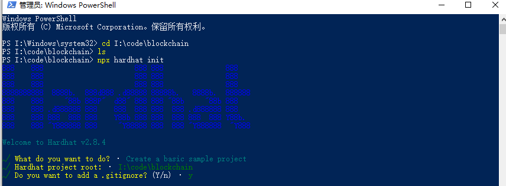
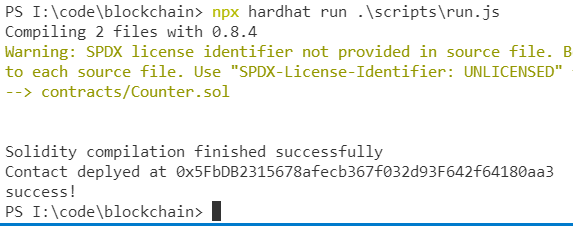
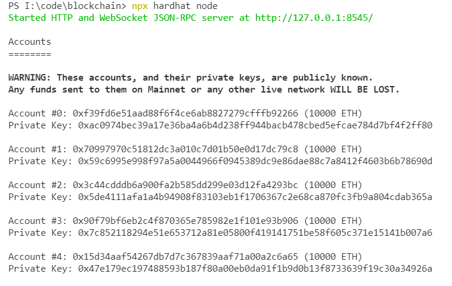
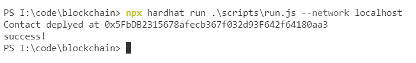
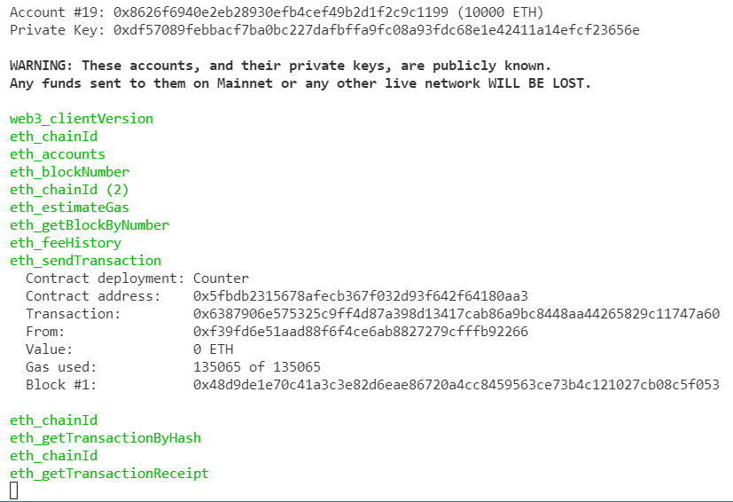
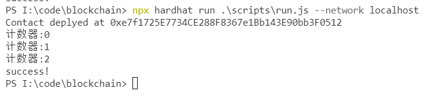
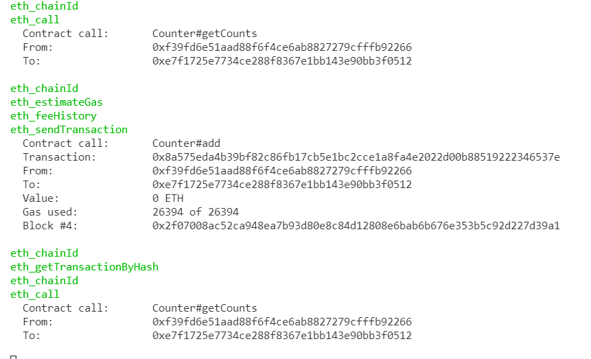
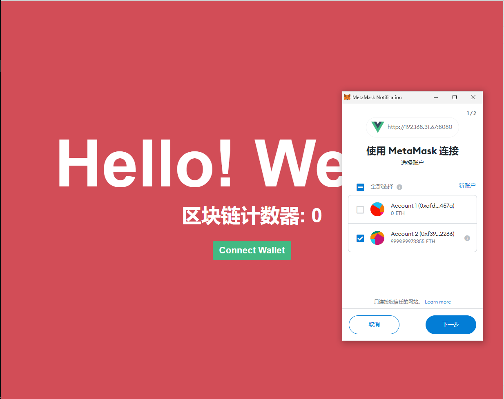
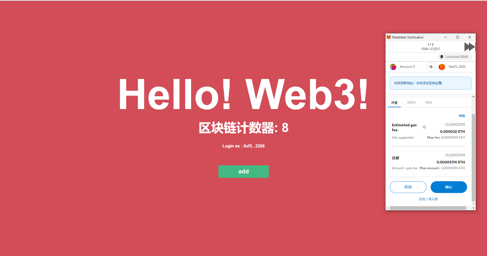

## 前言
作者也是最近才开始研究web3.0以及区块链相关技术，本篇博文内容及知识仅供参考，目前暂无权威的web3.0的定义。本篇内容仅代表作者初步理解。

## Web3.0
互联网迄今有两个阶段：Web 1.0 和 Web 2.0。
Web 1.0 阶段，是一个只读的网络，能读不能写。
Web 2.0 阶段，用户是内容的生产者，能读也能写。
Web 3.0 阶段的未来是？

按照以太坊的定义：Web2 指的是我们如今众所周知的互联网版本。具体指的是，通过个人数据和信息交换来提供服务互联网公司。

在以太坊的范畴内，**Web3指的是在区块链上运行的去中心应用程序**。所有用户都可以参与构建/使用这些App，个人数据却不需要被出卖。

## 区块链
区块链是“去中心化”的，其实我们不应该这样理解，2016年6月W3C的区块链会议上，以太坊核心开发团队就表示不再使用这个词，而完全的去中心化会导致效率十分低下，是不可行的。**区块链的核心是分布式**。区块链完全是一种分布式数据库。
在区块链系统中，总有些节点被选中进行数据整理、验证、打包，并把相关的改动广播出去，这个工作还是挺耗资源的，所以会有奖励机制。负责打包的节点会获得系统的奖励，类似积分，对于比特币系统来说，就是奖励比特币。有了奖励，很多节点都希望获得这样的奖励，于是有些区块链系统，比如比特币就会设计出一种竞争机制，让各个节点凭借自己的算力和资源去抢，能抢到这个数据打包的机会，就会获得奖励，也就是比特币。这个竞争的过程就是挖矿，同时也维护了区块链。


## 以太坊
以太坊（Ethereum）是一个建立在区块链技术之上， 去中心化应用平台。它允许任何人在平台中建立和使用通过区块链技术运行的去中心化应用。

以太坊平台对底层区块链技术进行了封装，让区块链应用开发者可以直接基于以太坊平台进行开发，只要专注于开发应用本身逻辑的智能合约，这样就可以大大降低开发难度。

目前围绕以太坊已经形成了一个最为完善的开发生态：有很多经过测试和验证的开发库、有完善的开发者文档及开发测试工具。

## P2P
区块链技术是通过纯P2P技术进行通信，以太坊的节点发现是通过 udp 发现可供使用的节点 url 并将这些 url 维护在本地的 table 中，通过 tcp 和其他节点进行连接并进行数据传输，当需要新的节点时从 table 中获取未接触过的 url 建立新的 tcp 连接。

以太坊底层分布式网络即P2P网络，使用了经典的Kademlia网络。一个想要加入网络的节点需要先经过启动过程。在这个阶段，该节点需要知道另一个已经在 Kademlia 网络中注册的节点的 IP 地址 （通过另一个使用者或储存的清单取得）。如果启动中的节点还不是网络的一部分，它便会计算一个尚未指定给其他节点的随机ID（160比特）编号。这个ID是由节点的对外IP地址跟端口号经过SHA-1算法散列之后得到的。这个 ID 会一直使用到离开网络为止。


## 智能合约

以太坊网络上运行程序就称之为智能合约， 它和其他的程序一样，也是代码和数据(状态)的集合。

它的概念很简单，就是将法律条文写成可执行代码。让法律条文的执行中立化，这个理念和区块链上的程序可以不被篡改、不被干预（只有有人触发交易，它将自动执行）的执行不谋而合，因此区块链引入了这个概念。

### 用户帐户
1. 地址（有点像我们的银行帐号 - 比特币也有同样的概念）
2. 余额（我有多少钱: 以太）

### 智能合约账户
1. 地址
2. 余额（有多少钱: 以太）
3. 状态
4. 代码

智能合约帐户的状态是智能合约中声明的所有变量和变量的当前状态。 它的工作方式与大多数编程语言中的类中的变量变量相同。 实际上，最简单方法去理解智能合约可以类比为一个类实例化对象，唯一的区别是这个对象永远存在区块链网络中，我们可以通过调用方法去改变这些状态，而这些方法也是写死，不被篡改、不被干预。

### 智能合约 之 众筹
以下是作者在互联网找到的一份比较完整的众筹合约，仅供参考。
```javascript
pragma solidity ^0.5.8;

contract zhongcouTest {

    // 捐赠者
    struct funder {
        address funderAddress; // 捐赠者地址
        uint toMoney; // 捐赠money
    }
    // 受益人对象
    struct needer {
        address payable neederAddress; // 受益人地址
        uint goal; // 众凑总数（目标）
        uint amount; // 当前募资金额
        uint isFinish; // 募资是否完成
        uint funderAccount; // 当前捐赠者人数
        mapping(uint => funder) funderMap; // 映射，将捐赠者的id与捐赠者绑定在一起，从而得知是谁给受益人捐钱
    }

    uint neederAmount; // 众筹项目id
    mapping (uint => needer) neederMap; // 通过mapping将受益人id与收益金额绑定在一起，从而可以更好的管理受益人

    // 新建众筹项目
    /*
    * _neederAddress: 受益人地址（项目发起者）
    * _goal: 众筹目标
    */
    function NewNeeder(address payable _neederAddress, uint _goal) public {
        neederAmount++;
        neederMap[neederAmount] = needer(address(_neederAddress), _goal, 0, 0, 0);
    }

    // 捐赠者给指定众筹id打钱
    /*
    *_neederAmount: 众筹项目id
    *_address: 捐赠者地址
    */
    function contribue(address _address, uint _neederAmount) public payable {
        require(msg.value > 0);
        needer storage _needer = neederMap[_neederAmount]; // 获取众筹项目
        require(_needer.isFinish == 0); // 募资是否完成， 若完成则取消当前捐款
        _needer.amount += msg.value; // 捐赠金额

        _needer.funderAccount++; // 捐赠者个数
        _needer.funderMap[_needer.funderAccount] = funder(_address, msg.value); // 标记捐赠者及捐赠金额
    }

    // 捐赠是否完成，若完整，给受益人转账
     /*
    *_neederAmount: 众筹项目id
    */
    function Iscompelete(uint _neederAmount) public payable{
        needer storage _needer = neederMap[_neederAmount]; // 获取众筹项目
        require(_needer.amount >= _needer.goal);
        _needer.neederAddress.transfer(_needer.amount);
        _needer.isFinish = 1; // 若完成募资，则取消继续募资
    }

    //  募资完成时，退款给捐赠人
    function returnBack(uint _neederAmount) public payable {
        needer storage _needer = neederMap[_neederAmount]; // 获取众筹项目
        require(_needer.funderMap[_needer.funderAccount].funderAddress == msg.sender);
        uint returnMoney = _needer.funderMap[_needer.funderAccount].toMoney;

        uint balance = address(this).balance;

        balance -= returnMoney;
        msg.sender.transfer(returnMoney);
    }

    // 查询合约余额
    function getBalance() public view returns(uint) {
        return address(this).balance;
    }

    // 查看募资状态
    function showData(uint _neederAmount) public view returns(uint, uint, uint, uint) {
        return (neederMap[_neederAmount].goal, neederMap[_neederAmount].isFinish, neederMap[_neederAmount].amount, neederMap[_neederAmount].funderAccount);
    }
}
```
通过对代码的分析我们可以得知智能合约是怎么运行的以及权限划分又是怎么样执行的。具体详细解析请[点击此处](https://github.com/Jacky-MYD/Crowd-funding-solidity)。
### 智能合约 之 以太猫

以太猫就是一份智能合约。以太猫简单来说就是一个让你可以在区块链上买卖以及繁殖电子猫的平台。这里的每一只猫都有自己独特的基因，而猫的基因将决定它的外表。当两只猫在平台上繁殖时，其后代的基因将由其父母的基因决定（需要注意的是这里的猫并没有性别的区分，任意两只猫在一起都可以繁殖下一代）。繁殖出的子代猫咪也可以像其父母一样在平台上进行买卖与繁殖。平台上的所有交易和操作都通过以太币进行，以太猫的开发者通过初期贩卖猫咪（的蛋）和收取交易手续费的方式来盈利。

[以太猫代码开源](https://jmaxu.github.io/post/%E4%BB%A5%E5%A4%AA%E7%8C%AB%E6%BA%90%E7%A0%81/)

[以太猫代码解析](https://zhuanlan.zhihu.com/p/34194613)

其实当我们看完我们就明白以太猫的设计其实和众筹差不多，同时他也可以是是一门货币，唯一的区别是，以太猫新增了0世代猫咪生成，通过随机函数或特定算法给于猫咪不同的基因，通过不同的稀有度产生不同的价值，以及猫咪繁衍的功能实现基因交换，产生更多的可能，这就是以太猫的价值以及可玩性。

### 智能合约 之 货币

大多数这些代币都是在以太坊上创建的，这个概念非常简单，我们需要关注以下几个信息。
1. 总供应量
2. 帐号
3. 账户中的金额
4. 代币的流动

```javascript
contract MyToken {
    mapping (address => uint256) public balances;
// 使用构造函数，我们可以在自己的帐户中设置初始供应量
    function MyToken(uint256 initialSupply) {
        balances[msg.sender] = initialSupply;
    }
// 代币的移动是通过简单的功能完成的，只需从一个帐户中减去并添加到另一个帐户
    function transfer(address to, uint256 amount) public {
        balances[msg.sender] -= amount;
        balances[to] += amount;
    }
}
```
智能合约的构造函数只能执行一次，然后这个对象就会一直保存在区块链上。以上代码简单演示代币的智能合约，如果需要深度了解 请点击 [创建属于自己的代币](https://learnblockchain.cn/2018/01/12/create_token/)

## 区块链与web3的关系

如果 Web3 确定是分布式的，那么区块链简直就是天然的基础设施。因为区块链是分布式数据库的一种实现，本身就是分布式的，而且信息一旦上链，就无法修改。
目前只是 Web3 的初始阶段，基础设施都还没有建成，玩法还在探索，但是进展很快。这个领域应该会诞生无数的创新和机会，值得密切关注。

## Web3实现一个基于区块链的计数器
本质上还是使用智能合约，web3是使用钱包登录这一场景，Web3 构建于区块链之上，按照区块链的设计，用户需要有一个数字钱包，它是你在虚拟世界的身份证和银行账户。你的身份、财产、消费，都通过这个数字钱包来标识。网站通过数字钱包的 ID，来识别你是谁。

### 安装以太坊 Ethereum 本地开发环境

```javascript
mkdir hardhat-tutorial
cd hardhat-tutorial
npm init --yes
npm install --save-dev hardhat
npm install --save-dev @nomiclabs/hardhat-ethers ethers @nomiclabs/hardhat-waffle ethereum-waffle chai
```



### 目录结构
```javascript
code/blockchain:

│  .gitignore
│  hardhat.config.js
│  package.json
│  README.md
│
├─contracts
│      Counter.sol
│
├─scripts
└─test
        sample-test.js
```

### 新建合约

在contracts(合约)新建一个Counter.sol文件，这个文件则是我们即将要编写的智能合约。

### 编写合约

```javascript
pragma solidity ^0.8.0;

import "hardhat/console.sol";

contract Counter {
    uint  counts;
    constructor() {
        counts = 0;
    }
    function add() public {
        counts = counts + 1
    }
    function getCounts() public view returns (unit256) {
        returns counts;
    }
}
```
### 编写上链代码
合约上链代码此处最简单的方式，调用hre对象的连接方法以及部署方法，成功后可获得合约链上地址。
```javascript
/*
 * @Ahthor: xiaoxi
 */
const main = async ()=>{
    const Counter = await hre.ethers.getContractFactory("Counter");
    const counter = await Counter.deploy();
    await counter.deployed();
    console.log(`Contact deplyed at ${counter.address}`)
}

main().then(()=>{
    console.log('success!')
    process.exit(0)
}).catch((err)=>{
    console.log(err)
    process.exit(1)
})

```
### 编译合约
终端执行下列代码，hardhat会自动编译并且执行你所编写的合约上链代码。hardhat内置了以太坊网络，您所编写的代码仅是上到本地的以太坊网络，仅供开发测试，并非部署到真正的以太坊网络。

```javascript
npx hardhat run .\scripts\run.js
```


### 运行本机节点
把本机作为接入点，通过运行`npx hardhat node`我们启动一个Hardhat Network实例。启动后将会得到20个账号，每个账号有10000ETH。
```javascript
npx hardhat node
```


### 编译合约并上链到本机
```javascript
npx hardhat run .\scripts\run.js --network localhost
```



Hardhat会自动从20个账号中选取第一个账号并用他的身份上链，上链成功后，可以在节点终端看到有一份新的合约上链并且花费了一些gas(燃气费、矿工费)。所以在真正的以太坊网络中您可以还需要充值一点ETH才能上链。



### 测试合约
测试合约应该是通过adress调用已经部署好的合约，执行合约的方法。

我们在合约部署的代码中可以访问到已部署的合约实例，为了方便，我们直接在合约部署之后执行一下合约方法，测试其功能是否正常。

#### 修改合约部署代码
执行合约中的getCount方法获取合约中的变量值，执行合约中的add方法使合约中的变量加一，再次执行合约中的getCount方法获取合约中的变量值，查看打印记录。
```javascript
/*
 * @Ahthor: xiaoxi
 */
const main = async ()=>{
    const Counter = await hre.ethers.getContractFactory("Counter");
    const counter = await Counter.deploy();
    await counter.deployed();
    console.log(`Contact deplyed at ${counter.address}`)
    let counts = await counter.getCounts()
    console.log("计数器:" + counts)
    await counter.add()
    counts = await counter.getCounts()
    console.log("计数器:" + counts)
    await counter.add()
    counts = await counter.getCounts()
    console.log("计数器:" + counts)
}

main().then(()=>{
    console.log('success!')
    process.exit(0)
}).catch((err)=>{
    console.log(err)
    process.exit(1)
})

```
#### 将修改过的合约重新部署到本地节点
可以发现合约中的值发生了变化。
```javascript
npx hardhat run .\scripts\run.js --network localhost
```


上链成功后，可以在节点终端查看到合约方法的执行，并且我们发现单纯的读取值是不会产生费用，如果需要修改值则会花费一些gas(燃气费、矿工费)。



### 前端开发
智能合约编写完成，其实就是完成了后端，是完全去中心化的后端。此时终于到前端开发了，前端开发的基本样式和Vue的相关知识本篇不在叙述。

#### 技术选型

作者使用vue3 + ts + sass + Vuex技术栈来演示，如有同学会react也可以使用react进行开发。
```javascript
vue create web3
npm run serve
```
#### UI设计
随便写一下一个用于显示区块链中count变量的页面。前端总体代码将放在在文章末。


#### 实现钱包登录
推荐使用MetaMask插件，生成属于自己的钱包。MetaMask插件会自动往浏览器window对象插入一个对象，通过这个对象向用户申请获取钱包地址从而实现用户登录。
```javascript
const checkIfWalletIsConnected = async () => {
  try {
    // 此处就不再声明Window的ethereum对象
    // eslint-disable-next-line @typescript-eslint/no-explicit-any
    const ethereum = (window as any).ethereum
    if (ethereum) {
      console.log('metamask is avaiable!')
    } else {
      alert('please install metamask!')
      console.log('please install metamask!')
      return
    }
    const accounts = await ethereum.request({
      method: 'eth_requestAccounts'
    })
    if (accounts.length !== 0) {
      const tempAccount = accounts[0]
      console.log(`found account with address ${tempAccount}`)
      account.value = tempAccount
      getCount()
    } else {
      console.log('no authorized account found.')
    }
  } catch (error) {
    console.log(error)
  }
}
```

#### 安装ethers
简易的 Web3 框架。
```javascript
npm install ethers
```
#### 使用ethers
##### 获取合约并执行getCounts方法
```javascript
const getCount = async () => {
  try {
    // 此处就不再声明Window的ethereum对象
    // eslint-disable-next-line @typescript-eslint/no-explicit-any
    const ethereum = (window as any).ethereum
    const provider = new ethers.providers.Web3Provider(ethereum)
    const signer = provider.getSigner()
    const CounterContract = new ethers.Contract(contractAddress, contractABI, signer)
    const tempCount = await CounterContract.getCounts()
    count.value = tempCount
  } catch (error) {
    console.log(error)
  }
}
```
##### 获取合约并执行add方法
```javascript
const add = async () => {
  try {
    // 此处就不再声明Window的ethereum对象
    // eslint-disable-next-line @typescript-eslint/no-explicit-any
    const ethereum = (window as any).ethereum
    const provider = new ethers.providers.Web3Provider(ethereum)
    const signer = provider.getSigner()
    const CounterContract = new ethers.Contract(contractAddress, contractABI, signer)
    const tx = await CounterContract.add()
    await tx.wait()
    await getCount()
  } catch (error) {
    console.log(error)
  }
}
```
#### 最后
将所编写的函数绑定到按钮上，进行测试，您的区块链计数器已完成，计数将保存到链上（本地以太坊网络）。


#### 源码

```javascript
<template>
<div class="container">
  <div class="title">Hello! Web3!</div>
  <div class="count">区块链计数器: {{count}}</div>
  <div class="account">Login as : {{account.substring(0,4)+'...'+account.substring(account.length - 4)}}</div>
  <div v-if="account" class="btn" @click="add">add</div>
  <div v-else class="btn" @click="checkIfWalletIsConnected">Connect Wallet</div>
</div>
</template>
<script lang="ts" setup>
import { ref } from 'vue'
import { ethers } from 'ethers'
import counter from './utils/Counter.json'

// 合约地址
const contractAddress = '0xe7f1725E7734CE288F8367e1Bb143E90bb3F0512'
// 合约ABI
const contractABI = counter.abi
const account = ref('')
const count = ref(0)
const checkIfWalletIsConnected = async () => {
  try {
    // 此处就不再声明Window的ethereum对象
    // eslint-disable-next-line @typescript-eslint/no-explicit-any
    const ethereum = (window as any).ethereum
    if (ethereum) {
      console.log('metamask is avaiable!')
    } else {
      alert('please install metamask!')
      console.log('please install metamask!')
      return
    }
    const accounts = await ethereum.request({
      method: 'eth_requestAccounts'
    })
    if (accounts.length !== 0) {
      const tempAccount = accounts[0]
      console.log(`found account with address ${tempAccount}`)
      account.value = tempAccount
      getCount()
    } else {
      console.log('no authorized account found.')
    }
  } catch (error) {
    console.log(error)
  }
}
const add = async () => {
  try {
    // 此处就不再声明Window的ethereum对象
    // eslint-disable-next-line @typescript-eslint/no-explicit-any
    const ethereum = (window as any).ethereum
    const provider = new ethers.providers.Web3Provider(ethereum)
    const signer = provider.getSigner()
    const CounterContract = new ethers.Contract(contractAddress, contractABI, signer)
    const tx = await CounterContract.add()
    await tx.wait()
    await getCount()
  } catch (error) {
    console.log(error)
  }
}
const getCount = async () => {
  try {
    // 此处就不再声明Window的ethereum对象
    // eslint-disable-next-line @typescript-eslint/no-explicit-any
    const ethereum = (window as any).ethereum
    const provider = new ethers.providers.Web3Provider(ethereum)
    const signer = provider.getSigner()
    const CounterContract = new ethers.Contract(contractAddress, contractABI, signer)
    const tempCount = await CounterContract.getCounts()
    count.value = tempCount
  } catch (error) {
    console.log(error)
  }
}
checkIfWalletIsConnected()
</script>

<style lang="scss">
.container {
  display: flex;
  flex-direction: column;
  align-items: center;
  justify-content: center;
  background-color:  #D24D57;
  height: 100vh;
  .title {
    font-size: 10rem;
    color: white;
    font-weight: bolder;
  }
  .count {
    font-size: 3rem;
    color: white;
    font-weight: bolder;
  }
  .btn {
    cursor: pointer;
    width: 12rem;
    height: 3rem;
    background-color: #42b983;
    margin: 2rem;
    color: white;
    display: flex;
    flex-direction: column;
    align-items: center;
    justify-content: center;
    border-radius: 5px;
    font-weight: bold;
    font-size: 1.4rem;
  }
  .account {
    color: white;
    margin: 2rem;
    font-weight: bolder;
  }
}
body {
  margin: 0;
  padding: 0;
}
</style>

```

### 总结
1. Web3指的是在区块链上运行的去中心应用程序，web3的未来可以期待，目前由于上链费用太高切速度慢，无法绝对去中心化。
2. 区块链下的以太猫其实也算是一种货币但带来了无穷乐趣。
3. 区块链可以说是全球性的分布式数据库、由各个节点(矿工)进行维护。
4. 矿工愿意维护是因为有奖励，矿工的任务是把新的交易信息(或程序执行的结果)写入新块中，只要不断地有交易(或程序执行的结果)矿工也不会停工。
5. 使用hardhat可以快速开发智能合约实现数据上链服务，数据不可篡改。
6. 智能合约其实就是一段程序代码，在区块链上将由矿工执行。

## 参考
本篇文章参考了大量的文章，无法一一列出，在此列出重点引用。

[Hardhat 入门教程](https://learnblockchain.cn/article/1356#6--%E7%94%A8-Hardhat-Network-%E8%B0%83%E8%AF%95)

[初探Web3.0｜建立基于区块链的计数器](https://www.bilibili.com/video/BV1ES4y1r7DL?spm_id_from=333.999.0.0)

[创建自己的数字货币（ERC20 代币）](https://learnblockchain.cn/2018/01/12/create_token/)

[完全理解以太坊智能合约](https://learnblockchain.cn/2018/01/04/understanding-smart-contracts/)

[区块链的基石：以太坊的 P2P 网络实现](https://zhuanlan.zhihu.com/p/40131454)

[搭建P2P网络的原理](https://zhuanlan.zhihu.com/p/40016577)

[区块链：浅谈为什么要挖矿](https://www.jianshu.com/p/80a6a0e4ac71)

[以太坊是什么 - 以太坊开发入门指南](https://learnblockchain.cn/2017/11/20/whatiseth/)

[为什么 Web3 与区块链有关](https://www.ruanyifeng.com/blog/2021/12/web3.html)
