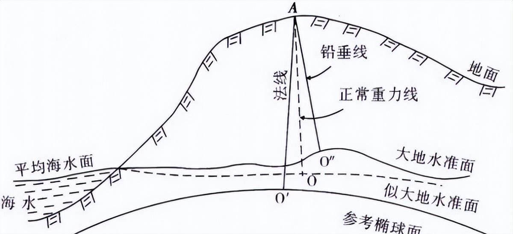
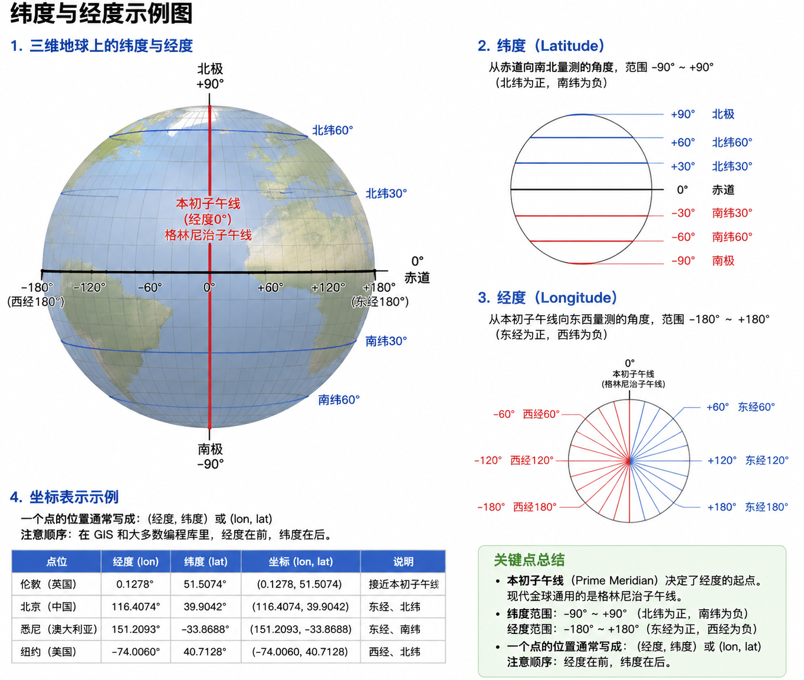
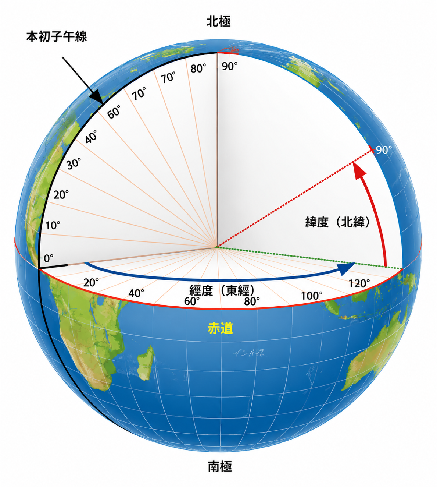

## 1 GIS 基本概念与空间数据
### 1.1 什么是 GIS？
简单说就是：**用计算机管理、分析、可视化“带位置的信息”的系统**。

它不只是“画地图”，而是把**位置**和**属性**结合起来，让你可以回答类似这样的问题：

+ 这个点在哪里？
+ 附近 500 米有什么？
+ 这两个区域是否重叠？
+ 某条路线经过了哪些区域？
+ 这个范围内的统计结果是多少？

对前端开发者来说，WebGIS 就是把这些能力搬到浏览器里，用地图作为交互界面

### 1.2 空间数据 vs 普通数据
普通数据（比如用户表、订单表）通常只有属性和 ID，没有“位置”概念，这是传统前端开发人员经常接触的数据。空间数据的核心是：**在上述普通数据的基础上加上明确的地理位置**。

它通常包含两部分：

+ **几何信息（Geometry）**：描述“在哪里、长什么样”（点、线、面的坐标）
+ **属性信息（Attribute）**：描述“是什么”（名称、类型、面积、状态等）

举例：

+ 一个兴趣点（POI）：几何是一个点坐标，属性是名称、地址、类别。
+ 一条道路：几何是一条线，属性是道路名称、等级、限速。
+ 一个行政区：几何是一个面（多边形），属性是行政区名称、人口、面积。

没有几何信息，就只是普通表格数据；有了几何信息，才能在地图上显示、查询、分析。

例如传统前端展示店铺列表通常采用列表的形式展示，如果加上了明确的地理位置就可以直接在地图上上帝视角的展示出来店铺信息与位置信息，使得那些更关注地理信息的人能有更好的交互体验。

### 1.3 空间数据的两大类型
#### 1.3.1 矢量数据
这部分是前端最常接触的数据，用点、线、面精确描述地理对象，适合表达边界清晰的事物。

| 类型 | 几何 | 常见例子 | 特点 |
| --- | --- | --- | --- |
| 点（Point） | 一个坐标 | 兴趣点、摄像头、设备 | 只有位置，没有大小 |
| 线（LineString） | 一串有序坐标 | 道路、河流、轨迹 | 有长度，有方向 |
| 面（Polygon） | 闭合的坐标环 | 建筑物、行政区、湖泊 | 有面积，有边界 |

优点：精度高、文件相对小、适合交互查询（点击某个要素获取属性）。

前端常见格式：GeoJSON、TopoJSON、WKT、Shapefile（需转换）。

##### 1.3.1.1 GeoJSON
基于 JSON 的开放标准（RFC 7946），专门为地理数据设计。它把**几何**和**属性**打包在一起，**也就是上面提到的空间数据，**是目前 Web 端最主流的矢量格式。

```json
{
  "type": "FeatureCollection",
  "features": [
    {
      "type": "Feature",
      "geometry": {
        "type": "Point",
        "coordinates": [116.397, 39.908]
      },
      "properties": {
        "name": "天安门",
        "type": "landmark"
      }
    },
    {
      "type": "Feature",
      "geometry": {
        "type": "Polygon",
        "coordinates": [[
          [116.39, 39.90],
          [116.40, 39.90],
          [116.40, 39.91],
          [116.39, 39.91],
          [116.39, 39.90]
        ]]
      },
      "properties": {
        "name": "某个区域",
        "area": 1.2
      }
    }
  ]
}
```

关键点：

+ 坐标顺序是 **[经度, 纬度]**（注意不是纬度在前）；
+ 现代规范推荐使用 WGS84（EPSG:4326）；
+ 几乎所有前端地图库（Leaflet、OpenLayers、Mapbox、ArcGIS JS）原生支持；

优点：简单、可读、前后端通用、带属性。

缺点：在 GeoJSON 里每个多边形都是完整独立描述的，**共享的那条边会被写两遍**，如果是全国省级行政区这种数据，相邻省之间有大量共享边界，重复存储的坐标会非常多，文件体积就会明显变大。

##### 1.3.1.2 TopoJSON
由 Mike Bostock（D3 作者）提出的 GeoJSON 扩展。最大特点是**记录拓扑关系**——相邻多边形共享的边界只存一次（称为 arc）。

```json
{
  "type": "Topology",
  "arcs": [
    // 弧段 0：省A 底部
    [[0, 0], [1, 0]],

    // 弧段 1：共享边（只存这一次）
    [[1, 0], [1, 1]],

    // 弧段 2：省A 顶部（从右往左）
    [[1, 1], [0, 1]],

    // 弧段 3：省A 左边（从上往下）
    [[0, 1], [0, 0]],

    // 弧段 4：省B 底部
    [[1, 0], [2, 0]],

    // 弧段 5：省B 右边
    [[2, 0], [2, 1]],

    // 弧段 6：省B 顶部（从右往左）
    [[2, 1], [1, 1]]
  ],
  "objects": {
    "provinces": {
      "type": "GeometryCollection",
      "geometries": [
        {
          "type": "Polygon",
          "arcs": [[0, 1, 2, 3]],      // 省A：底 → 共享 → 顶 → 左
          "properties": { "name": "省A" }
        },
        {
          "type": "Polygon",
          "arcs": [[4, 5, 6, -1]],     // 省B：底 → 右 → 顶 → 共享（反向）
          "properties": { "name": "省B" }
        }
      ]
    }
  }
}
```

关键点：

+ 共享边只存一份；
+ 坐标常被量化成整数 + 差分编码；
+ 行政区、国家边界这类数据压缩效果尤其明显（常可缩小 50%~80%）；
+ 大多数地图库不能直接读 TopoJSON，需要先用 topojson-client 转成 GeoJSON；

优点：适合“边界复杂且共享多”的数据（全国省界、区县界），通过共享边来减少数据量。

缺点：不适合点数据或几乎没有共享边的数据，结构复杂。

##### 1.3.1.3 WKT / WKB
该格式由开放地理空间联盟(OGC)制定，是一种文本标记语言（Well-Known Text），用于表示矢量几何对象、空间参照系统及空间参照系统之间的转换。它还有一个兄弟叫 WKB，是它的二进制表示方式，适于在传输和在数据库中存储相同的信息。

```text
POINT (116.397 39.908)

LINESTRING (116.39 39.90, 116.40 39.91, 116.41 39.90)

POLYGON ((116.39 39.90, 116.40 39.90, 116.40 39.91, 116.39 39.91, 116.39 39.90))

# 带坐标系的扩展写法（EWKT，PostGIS 常用）
SRID=4326;POINT(116.397 39.908)
```

关键点：

+ PostGIS 里大量函数直接支持 WKT / EWKT；
+ 前端偶尔会用到（比如从后端接口拿到几何字符串再解析）；

优点：极其简洁，适合在 SQL、日志、调试中使用。

缺点：没有属性字段，不能单独作为完整业务数据格式。

##### 1.3.1.4 Shapefile
Esri 在 1990 年代推出的格式，至今仍是很多政府、测绘、传统 GIS 软件的默认交换格式，是传统 GIS 的“老大哥”。

**它不是一个文件，而是一组文件**：

+ .shp：几何数据（二进制）；
+ .shx：索引；
+ .dbf：属性表（老式 dBase 格式）；
+ .prj：坐标系定义（可选但很重要）；
+ 还可能有 .cpg（编码）、.sbn 等；

关键点：

+ 一个 Shapefile 只能存一种几何类型（全是点，或全是线，或全是面）；
+ 字段名最长 10 个字符；
+ 对中文支持曾经很差（现在有所改善，但仍需注意编码）；
+ 历史上有 2GB 大小限制；
+ 没有真正的拓扑；

**前端几乎不能直接使用**，必须用工具（QGIS、GDAL/ogr2ogr、mapshaper 等）转换成 GeoJSON 或导入数据库。

#### 1.3.2 栅格数据
栅格数据把地表（或任意连续表面）划分成**规则的网格**，就像一张图片由很多像素组成一样。

+ 每一个小格子叫做一个 **Cell**（或 Pixel）
+ 每个格子存储一个（或多个）数值
+ 整个网格有明确的地理范围、分辨率和坐标系

可以简单理解为：**带地理位置的“图片”**。

**基本结构：**

| 概念 | 含义 | 举例 |
| --- | --- | --- |
| **行（Rows）** | 垂直方向有多少格 | 1000 行 |
| **列（Columns）** | 水平方向有多少格 | 1000 列 |
| **单元格大小（Cell Size / Resolution）** | 每个格子代表真实地面的大小 | 10米 × 10米 |
| **原点（Origin）** | 网格的起始位置（通常是左上角或左下角） | 某个经纬度 |
| **数值（Value）** | 每个格子里存的数据 | 高程 128.5 米、温度 26.3℃、颜色 RGB |
| **波段（Band）** | 一个格子可以存多个值（多波段） | 红、绿、蓝三个波段 |

**常见数值：**

| 类型 | 存储的内容 | 典型用途 | 前端常见形式 |
| --- | --- | --- | --- |
| **影像** | 颜色（RGB 或更多波段） | 卫星图、航拍图、底图 | 图片瓦片（TMS/WMTS） |
| **高程（DEM）** | 海拔高度 | 地形分析、三维、坡度计算 | GeoTIFF、Terrain 瓦片 |
| **单波段数值** | 某个连续变量 | 温度、降雨、人口密度、PM2.5 | GeoTIFF、图片渲染 |
| **分类栅格** | 类别代码（整数） | 土地利用类型、植被分类 | GeoTIFF |
| **多波段科学数据** | 多个科学变量 | 遥感分析、气象再分析数据 | GeoTIFF、NetCDF |

**常见栅格数据格式：**

| 类型 | 说明 | 特点 | 前端常见用法 | 典型例子 |
| --- | --- | --- | --- | --- |
| **图片瓦片**   （TMS / WMTS / XYZ） | 把大影像预先切成很多固定大小的小图片（通常 256×256 或 512×512） | 加载快、按需请求、支持多级缩放 | 地图库根据当前视野自动请求对应瓦片 | 高德、天地图、Google 卫星图、ArcGIS Online 底图 |
| **GeoTIFF** | 带有地理坐标信息的 TIFF 图片，可包含坐标系、变换参数、多波段数据 | 精度高、信息完整，但文件通常较大 | 一般不直接加载大文件，而是后端切瓦片，或使用 COG（Cloud Optimized GeoTIFF）按需读取 | 原始卫星影像、DEM 高程数据、分析结果 |
| **Terrain 瓦片** | 专门用于三维地形的瓦片格式 | 支持高程夸张、光照、坡度等三维效果 | 三维地球或三维场景中加载 | Cesium Terrain、Mapbox Terrain |
| **热力图** | 由点数据动态生成的栅格效果 | 实时计算、可视化密度分布 | 前端根据点数据即时生成并渲染 | 人口热力、订单密度、轨迹热力 |
| **NetCDF / HDF** | 科学数据常用的多维数组格式 | 可存储多变量、多时间维度的数据 | 前端较少直接使用，通常后端处理后转成瓦片或图片 | 气象再分析数据、海洋、气候数据 |

**优点**

+ 非常适合表达**连续变化**的现象（地形、温度、影像、污染浓度等）；
+ 结构规则，计算方便（很多空间分析算法对栅格更友好）；
+ 和遥感、摄影测量结合紧密；
+ 做热力图、地形夸张、坡度坡向分析很方便；

**缺点**

+ **文件体积通常很大**（尤其是高分辨率影像）；
+ 放大后会出现明显的**锯齿（像素感）**；
+ 不适合表达精确的边界（比如行政区、地块边界用栅格会很模糊）；
+ 存储稀疏数据效率低（很多地方是空值也要占空间）；
+ 坐标系和投影变换成本较高；

#### 1.3.3 两种数据对比以及作用
| 对比维度 | 矢量（Vector） | 栅格（Raster） |
| --- | --- | --- |
| 表达方式 | 点、线、面（精确坐标） | 规则网格 + 数值 |
| 适合对象 | 边界清晰的事物 | 连续变化的表面 |
| 精度 | 可以非常精确 | 受单元格大小限制 |
| 文件大小 | 通常较小 | 通常较大 |
| 放大效果 | 始终清晰 | 会出现像素感 |
| 属性 | 每个要素有丰富属性 | 主要靠格子的值，属性较弱 |
| 前端加载 | GeoJSON / TopoJSON 等 | 图片瓦片 或 GeoTIFF |

### 1.4 空间参考系统（CRS）为什么重要？
所有空间数据都必须回答一个问题：**这些坐标是基于什么标准定义的？**

这就是**空间参考系统（Coordinate Reference System，简称 CRS）**的作用。它规定了：

+ 用什么地球模型（椭球体）
+ 原点在哪里
+ 单位是什么（度还是米）
+ 如何把球面位置映射到平面

如果两份数据用了不同的 CRS，直接叠在一起就会**错位**（偏移几十米到几百米都常见）。

**对前端开发者的实际意义以及现实问题：**

+ 底图是 Web Mercator（EPSG:3857），业务数据却是经纬度（EPSG:4326），不转换就会偏；
+ 国内高德/百度用的是加密坐标系（GCJ-02 / BD-09），GPS 原始坐标直接用会偏移；
+ 前端用 turf.js 算距离，如果不注意坐标系，结果可能完全错误；
+ 加载 GeoJSON 时，地图库默认假设是某种坐标系，实际数据却是另一种；

空间数据 = 几何（位置形状） + 属性（业务信息）。 GIS 的核心就是管理这些带位置的数据，并在正确的坐标系下进行显示、查询和分析。

## 2 地球模型：从真实地球到数学模型
### 2.1 真实的地球长什么样？
地球不是圆的，也不是完美的椭圆。

+ 大地水准面（Geoid）：由重力定义的“平均海平面”延伸到陆地后形成的不规则曲面。它是真正的“水平面”，但形状复杂，没法直接用简单公式计算。
+ **参考椭球体（Ellipsoid / Spheroid）**：用一个规则的旋转椭球去近似大地水准面。

GIS 和测绘几乎所有计算，都是在参考椭球体上进行的，而不是在真实的大地水准面上。

大地水准面像一个表面凹凸不平的土豆，参考椭球体是我们人为做的、表面光滑的“标准土豆模型”。

在 WebGIS 学习中，可以把 **Ellipsoid** 和 **Spheroid** 当成同一个东西。地球模型用的是「两极稍扁的旋转椭球体」，习惯上统称「椭球体」。



### 2.2 基准面（Datum）
上一节讲了椭球体（Ellipsoid / Spheroid）只是定义了地球的形状和大小。

但光有形状还不够——还必须决定：

+ 这个椭球的**中心**放在哪里？
+ 坐标轴怎么**朝向**？
+ 经度 0 度从哪里开始？

这一套“如何把椭球固定到真实地球上”的规则，就叫**基准面（Datum）**。

| 概念 | 作用 | 类比 |
| --- | --- | --- |
| 椭球体 | 定义地球的形状和大小 | 做一个标准大小的篮球 |
| **基准面** | 决定这个球放在哪里、怎么转 | 决定球心位置 + 旋转角度 |

基准面 = 椭球体 + 原点位置 + 坐标轴方向。

同一个物理点，在不同基准下算出来的经纬度数值会不一样，这就是很多“点偏了”问题的最根本原因之一。

#### 2.2.1 地心基准（Geocentric Datum）
+ 原点尽量放在**地球质心**附近；
+ 适合全球统一使用；
+ 现代主流选择；

#### 2.2.2 参心基准（Regional Datum）/区域基准
+ 原点故意放在某个区域，让该区域拟合得最好；
+ 局部精度高，但跨区域或与全球数据叠加时容易出问题；

常见代表：

+ **北京54**：早期使用，基于克拉索夫斯基椭球；
+ **西安80**：1980年代建立，原点在陕西泾阳（西安附近），更适合中国区域；

#### 2.2.3 常用基准对比
| 基准面 | 类型 | 椭球 | 主要特点 | 现在使用情况 |
| --- | --- | --- | --- | --- |
| **WGS84** | 地心 | WGS84 | GPS 默认，全球标准 | 广泛使用 |
| **CGCS2000** | 地心 | 与WGS84几乎相同 | 中国现行国家标准 | 正式推广使用中 |
| **西安80** | 参心 | IAG 75 | 原点在中国中部，局部拟合较好 | 历史数据常见 |
| **北京54** | 参心 | 克拉索夫斯基 | 早期数据，精度相对较低 | 老旧测绘资料 |

**关键点：**

+ CGCS2000 与 WGS84 在定义上高度一致，椭球参数差异极小（扁率差异导致的最大坐标差约 0.1 mm）；
+ 在绝大多数 WebGIS 场景（底图叠加、普通定位、业务展示）中，可以直接把 CGCS2000 坐标当作 WGS84 使用；
+ 真正需要注意的是老数据（北京54、西安80），它们与 WGS84/CGCS2000 的差异可达几十米甚至更多；

**为什么国家还要单独定义 CGCS2000，而不是直接用 WGS84？**

因为大地坐标系是国家基础地理信息的重要基础设施，涉及国家安全、边界、测绘成果管理等。

+ WGS84 由美国国家地理空间情报局（NGA）维护和更新。
+ 中国作为主权国家，需要有一个**自己定义、自己维护、自己更新**的国家大地坐标系，而不是完全依赖外国系统。

这和很多国家（例如欧洲用 ETRS89）的做法是一样的——即使技术上高度兼容，也要有本国的官方基准。

**对比：**

| 项目 | WGS84 | CGCS2000 |
| --- | --- | --- |
| 维护方 | 美国 NGA | 中国（国家测绘部门） |
| 参考框架基础 | 多个 ITRF 版本演变 | 以 ITRF97 为基准，历元 2000.0 |
| 实现站点 | 全球约 20–30 个核心站 | 中国大量 CORS 站 + 空间大地网 |
| 坐标时间属性 | 动态（观测历元） | 固定在 2000.0 历元 |

因为实现不同，同一个物理点在两个系统下的坐标，理论上会有厘米到分米级的差异（主要来自框架和历元差异，而不是椭球参数本身）。

国家通过自己的连续运行基准站网来维护 CGCS2000，可以保证在中国境内的精度和一致性，也便于与北斗系统、国家控制网对接。

国家之前长期使用北京54、西安80（都是参心坐标系）。需要一个统一的、现代的、地心的国家坐标系，把全国的测绘成果逐步过渡过来。CGCS2000 就是这个官方过渡目标。法律和行业标准（测绘法及相关规范）要求使用国家大地坐标系。

### 2.3 地心坐标系 vs 参心坐标系
+ **地心坐标系**（Geocentric）： 原点在地球质心附近。WGS84、CGCS2000 都属于这一类。适合全球统一使用。
+ **参心坐标系**（Local / Topocentric 倾向）： 原点选在某个区域，让该区域的椭球和大地水准面拟合得更好。北京54、西安80 属于这一类。在局部地区精度高，但跨区域或与全球数据叠加时容易出问题。

### 2.4 前端可能遇到的现实问题
+ 坐标偏移的根源：很多“点偏了”其实是因为数据用的基准和底图用的基准不一致；
+ CGCS2000 ≈ WGS84：在绝大多数前端场景（高德、腾讯、天地图、Leaflet、Mapbox）里，你可以直接把 CGCS2000 的经纬度当 WGS84 用，误差通常在可接受范围内；
+ 老数据坑：如果你拿到北京54 或西安80 的坐标，直接当 WGS84 用，偏移会非常明显，需要进行转换；

## 3 地理坐标系（Geographic Coordinate System, GCS）
### 3.1 什么是地理坐标系？
地理坐标系是一种用**经度（Longitude）**和**纬度（Latitude）**在椭球面上表示位置的坐标系。

+ 它直接在**椭球面**上描述位置，而不是平面。
+ 单位通常是**度（°）**。
+ 一个完整的地理坐标系 = **椭球体 + 基准面 + 本初子午线 + 角度单位**。

可以简单记：地理坐标系 = 椭球 + 基准面 + 如何量角度。

### 3.2 经度和纬度是怎么定义的？
在选定的椭球和基准面基础上：

+ **纬度（Latitude）**：从赤道向南北量测的角度，范围 -90° ~ +90° （北纬为正，南纬为负）
+ **经度（Longitude）**：从本初子午线向东西量测的角度，范围 -180° ~ +180° （东经为正，西经为负）

关键点：

+ **本初子午线**（Prime Meridian）决定了经度的起点。现代全球通用的是**格林尼治子午线**。
+ 一个点的位置通常写成：(经度, 纬度) 或 (lon, lat)。
+ 注意顺序：在 GIS 和大多数编程库里，**经度在前，纬度在后。**



### 3.3 地理坐标系的核心构成要素
| 要素 | 作用 | 例子 |
| --- | --- | --- |
| 椭球体 | 定义地球形状和大小 | WGS84 椭球 |
| 基准面 | 决定椭球的位置和方向 | WGS84 Datum |
| 本初子午线 | 经度的起点 | 格林尼治子午线 |
| 赤道 | 纬度的起点 | 赤道 |
| 角度单位 | 如何表示角度 | 度（Degree） |

这四个要素缺一不可。换掉其中任何一个，坐标系就变了，同一个物理点的经纬度数值也会改变。



### 3.4 最常见的两个地理坐标系
| EPSG 代码 | 名称 | 说明 | WebGIS 中的地位 |
| --- | --- | --- | --- |
| **4326** | WGS 84 | 基于 WGS84 椭球 + WGS84 基准面 | GeoJSON 标准、GPS 默认、最常用 |
| **4490** | CGCS2000 | 基于 CGCS2000 椭球 + CGCS2000 基准面 | 中国现行国家地理坐标系 |

在绝大多数 Web 开发场景中，EPSG:4326 是最常接触的地理坐标系。

### 3.5 地理坐标系的优点与局限
**优点：**

+ 适合**存储**和**全球数据交换**（GeoJSON、很多 API 都用 4326）
+ 不依赖投影，全球统一，不会因为投影选择不同而产生额外变形
+ GPS、手机定位直接输出的就是这种坐标

**局限（非常重要）：**

+ **不能直接用欧氏距离公式算距离和面积** 因为 1° 经度在赤道和在北极附近的实际长度差别巨大。
+ 不适合直接在屏幕上画地图（地球是曲面，屏幕是平面），必须再经过**投影**变成平面坐标。
+ 在高纬度地区，同样的经度差对应的实际距离会明显变短。

WebGIS 经典工作流：

+ 数据存储 / 传输 → 用地理坐标系（4326 或 4490）；
+ 地图显示 → 投影到 Web Mercator（3857）；
+ 距离 / 面积计算 → 绝对不要直接用欧氏距离（Math.sqrt((x2-x1)² + (y2-y1)²)）去算经纬度！用球面公式（Haversine/Turf.js）或先投影再算，或使用 geography 类型；
+ 在 Leaflet、Mapbox、OpenLayers 中，默认输入的经纬度通常按 4326 处理，库会自动帮你投影到当前底图的坐标系；

## 4 地图投影与投影坐标系（Projected Coordinate System, PCS）
前面我们了解了地理坐标系（用经纬度在椭球面上表示位置）。

但屏幕是平的，很多计算（尤其是距离、面积在小范围内）在平面上更方便，所以需要把球面“压扁”到平面上——这就是地图投影。

### 4.1 为什么需要投影？
+ 地球是曲面，电脑屏幕、纸张是平面；
+ 地理坐标系（经纬度）不适合直接量距离和面积（1° 经度在赤道和北极长度差很大）；
+ 投影后得到平面直角坐标（单位通常是**米**），方便计算和显示；

**投影坐标系（PCS）** = 地理坐标系 + 投影方法 + 投影参数 + 线性单位。

### 4.2 投影必然产生的变形
把球面展成平面，不可能同时保持所有几何性质。 投影一定会在以下四个方面产生变形（只是侧重点不同）：

| 变形类型 | 说明 | 例子 |
| --- | --- | --- |
| **角度** | 方向、形状是否保持 | 墨卡托保持角度 |
| **距离** | 长度是否正确 | 等距投影 |
| **面积** | 区域大小是否正确 | 阿尔伯斯等积投影 |
| **形状** | 整体外形是否扭曲 | 多数投影都会变形 |

### 4.3 投影按性质分类
| 类型 | 英文 | 保持什么 | 典型用途 | 代表投影 |
| --- | --- | --- | --- | --- |
| **等角投影** | Conformal | 角度、形状（局部） | 航海、Web地图、工程 | 墨卡托、横轴墨卡托 |
| **等积投影** | Equal-area | 面积 | 统计、资源分布 | 阿尔伯斯、Lambert等积 |
| **等距投影** | Equidistant | 某些方向的距离 | 特定距离量测 | 等距圆柱、方位等距 |
| **综合投影** | Compromise | 折中 | 世界地图 | 罗宾森、温克尔等 |

### 4.4 前端必须重点掌握的投影
#### 4.4.1 墨卡托（Mercator）与 Web 墨卡托（Pseudo-Mercator）
+ **标准墨卡托**：等角圆柱投影，高纬度面积严重放大（格陵兰看起来和非洲差不多大）。
+ **Web 墨卡托（EPSG:3857）**：几乎所有在线地图（Google、OSM、高德、天地图、Leaflet、Mapbox）使用的显示坐标系。
    - 它是“伪”墨卡托，把地球当成球体来计算，速度更快。
    - 单位是米。
    - 只适合显示，不适合精确面积计算。

**记忆**：数据存 4326，显示用 3857。

#### 4.4.2 横轴墨卡托 / 高斯-克吕格（Gauss-Kruger）
+ 中国最常用的投影（地形图、工程测量）。
+ 把地球按经度分成 3° 或 6° 带，每带单独投影。
+ 中央经线附近变形很小，适合大比例尺测图。
+ 广州2000、很多城市独立坐标系都基于它。

#### 4.4.3 UTM（Universal Transverse Mercator）
+ 全球通用的横轴墨卡托分带系统（60个带）。
+ 中国部分地区也用，但国内更常用高斯-克吕格。

#### 4.4.4 阿尔伯斯等积圆锥（Albers）
+ 中国全国范围统计、国土面积计算常用。
+ 保持面积正确，适合做专题统计地图。

### 4.5 投影坐标系的构成
投影坐标系 = 地理坐标系（椭球 + 基准）

  + 投影方法（墨卡托、高斯-克吕格…）

  + 投影参数（中央经线、标准纬线、原点纬度、假东假北…）

  + 线性单位（米）

换任何一个参数，坐标系就变了。

### 4.6 前端可能遇到的现实问题
**为什么 Web 地图几乎都用 3857 显示，却常用 4326 存数据？**

+ 存储用 4326（经纬度）：
    - 全球统一，不依赖任何投影。
    - 数据交换标准（GeoJSON 就是强制用 4326）。
    - 不会因为投影选择不同而产生额外变形或数据丢失。
    - 方便后续做任何投影转换。
+ 显示用 3857（Web 墨卡托）：
    - 所有主流在线底图（Google、OSM、高德、天地图、Mapbox 等）的瓦片都是按 3857 切的。
    - 它是等角投影，方向正确，适合导航和可视化。
    - 计算简单、渲染速度快，适合网页实时显示。

总结： 4326 负责“准确表达位置”，3857 负责“漂亮且高效地显示在屏幕上”。两者分工明确。

**如果要在广州做精确的工程测量，应该用什么投影？为什么不用 Web 墨卡托？**

推荐投影：高斯-克吕格投影（横轴墨卡托），具体使用广州本地的独立坐标系（广州2000）或 CGCS2000 的 3° 带高斯投影。

广州位于北纬 23° 左右，用 3857 会导致明显的长度和面积变形，无法满足工程测量规范要求。所以必须用针对广州优化过的高斯-克吕格投影（中央经线约 113°17′）。

## 5 常用坐标系
### 5.1 全球通用
| EPSG | 名称 | 类型 | 单位 | 核心用途 | 前端注意点 |
| --- | --- | --- | --- | --- | --- |
| **4326** | WGS 84 | 地理坐标系 | 度 | GPS 默认、GeoJSON 标准、数据存储与交换首选 | 最常用的经纬度坐标系 |
| **3857** | Web Mercator （Pseudo-Mercator） | 投影坐标系 | 米 | 几乎所有在线地图底图的显示坐标系 | Leaflet / Mapbox / 高德 / 天地图 默认显示用这个 |

### 5.2 国内相关（广州地区）
| 名称 | EPSG / 代码 | 类型 | 说明 | 现状与注意 |
| --- | --- | --- | --- | --- |
| **CGCS2000** | 4490 | 地理坐标系 | 中国现行国家大地坐标系 | 2018年后全面推广，与WGS84差异极小 |
| **北京54** | 4214 | 地理坐标系 | 早期国家坐标系 | 历史数据常见，需转换 |
| **西安80** | 4610 | 地理坐标系 | 过渡期国家坐标系 | 历史数据常见，需转换 |
| **GCJ-02** （火星坐标系） | 无标准EPSG | 加密地理坐标系 | 国测局加密，高德、腾讯等使用 | 与WGS84有 **50~500米** 非线性偏移 |
| **BD-09** （百度坐标系） | 无标准EPSG | 加密地理坐标系 | 在GCJ-02基础上再加密 | 偏移更大，百度地图专用 |
| **广州2000** | 无标准EPSG | **投影坐标系** | 广州市基于CGCS2000建立的地方坐标系，采用高斯-克吕格投影，中央经线约113°17′ | 广州本地规划、测绘、工程强制使用。参数不公开完整发布，转换需通过官方或有资质单位 |

**关键点：**

+ GCJ-02 和 BD-09 没有官方 EPSG 代码，不能直接用 proj4 的标准定义转换，需要专用加密/解密算法（如 gcoord、coordtransform 等库）；
+ 高德、腾讯地图返回的经纬度默认是 GCJ-02，百度地图是 BD-09；
+ 天地图、国家相关数据一般是 CGCS2000；
+ GPS 芯片、国际数据是 WGS84（4326）；

直接把 WGS84 的点丢到高德地图上，会明显偏掉，这就是最常见的“点偏了”原因。

**常见场景推荐：**

| 场景 | 推荐坐标系 | 原因 |
| --- | --- | --- |
| 数据存储 / 接口传输 | 4326 或 4490 | 标准、通用 |
| Leaflet / Mapbox 显示 | 直接传 4326 经纬度 | 库会自动转 3857 |
| 对接高德 / 腾讯 | 转成 GCJ-02 | 否则会偏移 |
| 对接百度 | 转成 BD-09 | 否则会偏移 |
| 对接天地图 | CGCS2000 / 4326 | 基本兼容 |
| 计算距离（前端） | 用 Turf.js 在 4326 下算 | 简单可靠 |

## 6 坐标系标识与查询
### 6.1 EPSG 代码（也叫 WKID）
**EPSG 代码**是目前全球最通用的坐标系唯一标识符。

+ 全称：European Petroleum Survey Group（现在由 IOGP 维护）；
+ 每个正式注册的坐标系都有一个唯一的数字编号；
+ 在代码、数据库、GIS 软件里，用这个数字就能精确指定坐标系；

| EPSG 代码 | 对应坐标系 | 类型 |
| --- | --- | --- |
| 4326 | WGS 84 | 地理坐标系 |
| 3857 | Web Mercator | 投影坐标系 |
| 4490 | CGCS2000 | 地理坐标系 |
| 4214 | Beijing 1954 | 地理坐标系 |
| 4610 | Xian 1980 | 地理坐标系 |
| 2326 | Hong Kong 1980 Grid | 投影坐标系 |

### 6.2 权威查询网站：epsg.io
**推荐的查询工具**：[https://epsg.io](https://epsg.io)

可以：

+ 直接搜索数字（如 4326、3857、4490）；
+ 搜索名称（如 CGCS2000、Web Mercator）；
+ 查看完整定义（椭球、基准、投影参数、单位、适用范围等）；
+ 获取 WKT、PROJ 字符串、JSON 等多种格式；
+ 查看这个坐标系覆盖哪些地区；

### 6.3 常见问题
**数据没有 CRS 信息时会发生什么？**

这是实际项目中**最高频的问题之一**：

+ 很多 CAD、Excel、旧系统导出的数据**没有附带坐标系信息**；
+ GIS 软件或前端库不知道它是 4326、3857 还是广州2000，只能靠猜或默认；
+ 结果就是：数据加载后整体偏移、对不上底图，或者计算距离完全错误；

**典型表现**：

+ 点跑到了非洲或太平洋；
+ 和底图差几百米到几公里；
+ 明明坐标数字看起来合理，位置却不对；

**解决原则**：

1. 数据必须明确告知坐标系（最好带 EPSG 代码或完整 WKT）；
2. 如果没有，先问数据提供方“这是什么坐标系？”；
3. 实在不知道，不要盲目假设是 4326；

**数字特征分析法：**

| 数字特征 | 可能是什么 | 说明 |
| --- | --- | --- |
| 经度 70~140，纬度 15~55 左右的小数 | 地理坐标（经纬度） | 中国范围内的 lon/lat |
| 数字很大（几百万、上千万） | 投影坐标（平面坐标） | 高斯投影或城市独立坐标系常见 |
| Y 值大约 7 位数，且前面带带号（如 38xxxxxx） | 带号的高斯投影 | 常见于国家分带 |
| 数字在广州附近，X/Y 都是 6~7 位数 | 可能是广州本地坐标系 | 需进一步确认 |

## 7 坐标系转换
怎么把坐标从 A 坐标系转换到 B 坐标系？

### 7.1 转换的本质
坐标系转换本质上是**数学变换**，主要包含两类：

1. **不同基准之间的转换**（Datum Transformation） 涉及椭球中心位置、轴向旋转、尺度等变化（如北京54 → CGCS2000）。
2. **投影变换**（Projection Transformation） 在同一个基准下，从地理坐标（经纬度）转到平面坐标，或不同投影之间转换（如 4326 → 3857）。

实际工作中，经常是两者同时发生。

### 7.2 常见转换场景
| 场景 | 示例 | 难度 | 前端常用方法 |
| --- | --- | --- | --- |
| **地理 ↔ 投影** | 4326 ↔ 3857 | 简单 | proj4js / Leaflet 自动处理 |
| **同一基准不同投影** | CGCS2000 地理 ↔ 高斯投影 | 中等 | proj4js |
| **不同基准** | 北京54 / 西安80 → CGCS2000 | 较复杂 | 需要转换参数（三参数/七参数） |
| **加密坐标系** | WGS84 ↔ GCJ-02 ↔ BD-09 | 特殊 | **gcoord** 或 coordtransform |
| **城市独立坐标系** | 广州2000 ↔ CGCS2000 | 困难 | 通常需官方参数或服务 |

### 7.3 前端常用工具
#### 7.3.1 proj4js（通用投影转换）
+ 支持绝大多数标准 EPSG 坐标系；
+ 适合 4326、3857、4490、高斯投影等；
+ 不直接支持 GCJ-02 / BD-09（因为它们不是标准投影）；

#### 7.3.2 gcoord（国内加密坐标系首选）
+ 专门处理 WGS84、GCJ-02、BD-09 之间的转换；
+ 使用简单，精度足够日常业务使用；

#### 7.3.3 后端 / 数据库推荐 PostGIS
+ **PostGIS**：ST_Transform(geometry, target_srid)；
+ 最准确、性能好，适合大量数据转换；
+ 支持标准 EPSG，也可自定义投影；

### 7.4 转换精度与注意事项
+ **参数决定精度** 不同基准转换必须有正确的转换参数（三参数、四参数、七参数）。参数不对，结果会偏几米到几百米。
+ **GCJ-02 / BD-09 是非线性加密** 不能用普通投影转换公式，必须用专用算法。
+ **城市独立坐标系（如广州2000）** 完整参数通常不公开，实际项目中优先让数据提供方转换，或使用官方转换服务。
+ **小范围可用近似** CGCS2000 ≈ WGS84（Web场景可直接当同一个用）。
+ **转换方向要搞清楚** 从 A 转到 B，和从 B 转到 A，参数是不同的（有时是逆变换）。
+ 国内互联网地图用加密坐标系，是法规要求必须这么做，目的是管控公开地理信息的精度和流通方式。虽然算法已经公开，但合规要求依然存在，所以地图服务商必须继续使用。

## 8 距离与面积计算
怎么正确计算两点之间的距离，以及多边形的面积？

### 8.1 为什么在 4326 下直接用欧氏距离是错的？
地理坐标系（EPSG:4326）的单位是**度**，不是米。

+ 赤道上 1° 经度 ≈ 111 km；
+ 到了北纬 60°，1° 经度只剩约 55.5 km；
+ 纬度每 1° 大约都是 111 km（相对稳定）；

```plain
Math.sqrt((lon2 - lon1) ** 2 + (lat2 - lat1) ** 2)
```

算出的结果完全没有实际意义，误差会非常大。经纬度不能直接当平面坐标算距离。

### 8.2 正确的距离计算方法
| 方法 | 精度 | 适用场景 | 前端实现 |
| --- | --- | --- | --- |
| **Haversine 公式** | 较高（把地球当球体） | 绝大多数业务场景 | 自己写 或 Turf.js |
| **Vincenty 公式** | 更高（考虑椭球） | 需要较高精度时 | 较少直接用 |
| **投影后平面距离** | 小范围内很高 | 已投影到合适坐标系 + 范围较小 | 先投影再算欧氏距离 |
| **PostGIS geography** | 很高 | 后端数据库计算 | `ST_Distance` |

### 8.3 前端推荐做法：使用 Turf.js
Turf.js 是目前前端计算距离和面积最方便、可靠的库。

**计算距离：**

```javascript
import * as turf from '@turf/turf';

const from = turf.point([113.2644, 23.1291]); // [经度, 纬度]
const to   = turf.point([113.3245, 23.1567]);

const distance = turf.distance(from, to, { units: 'kilometers' });
console.log(distance); // 单位：公里
```

**计算面积：**

```javascript
const polygon = turf.polygon([[
  [113.26, 23.12],
  [113.28, 23.12],
  [113.28, 23.14],
  [113.26, 23.14],
  [113.26, 23.12]
]]);

const area = turf.area(polygon); // 返回平方米
```

### 8.4 后端 / 数据库做法（PostGIS）
PostGIS 区分两种类型，非常重要：

| 类型 | 说明 | 距离计算方式 |
| --- | --- | --- |
| **geometry** | 平面几何 | 直接欧氏距离（适合已投影数据） |
| **geography** | 球面/椭球几何 | 自动按球面计算（适合经纬度） |

```plsql
-- 推荐：用 geography 计算真实距离
SELECT ST_Distance(
  ST_GeogFromText('POINT(113.2644 23.1291)'),
  ST_GeogFromText('POINT(113.3245 23.1567)')
);  -- 返回米
```

### 8.5 选择原则
| 情况 | 推荐方法 |
| --- | --- |
| 数据是经纬度，范围较大（跨城市、跨省） | Haversine 或 Turf.js / geography |
| 数据已投影，且范围较小（几公里内） | 直接平面欧氏距离 |
| 需要较高精度 | Vincenty 或 PostGIS geography |
| 全国范围面积统计 | 使用等积投影后再计算，或专业库 |

**常见错误：**

+ 把经纬度直接当米来算距离 → 结果完全错误；
+ 在 Web 墨卡托（3857）下直接算大范围距离/面积 → 高纬度误差明显；
+ 用平面公式算跨越大范围的面积 → 严重失真；
+ 忘记单位换算（米 / 公里）；

## 9 WebGIS 中的坐标系实践与常见陷阱
### 9.1 推荐的标准工作流
| 环节 | 推荐坐标系 | 原因 |
| --- | --- | --- |
| **数据存储 / 接口传输** | EPSG:4326 或 CGCS2000 | 全球通用、无投影变形、方便交换 |
| **地图显示** | EPSG:3857 | 匹配几乎所有在线底图瓦片 |
| **距离 / 面积计算** | 在正确的 CRS 下进行 | 经纬度用球面公式，平面坐标用欧氏距离 |
| **对接高德 / 腾讯** | 转成 GCJ-02 | 否则会偏移 |
| **对接百度** | 转成 BD-09 | 否则会偏移 |

### 9.2 国内地图最常见的偏移问题及排查思路
**典型现象**：点在地图上偏了几十到几百米。

**排查顺序（建议按这个来）：**

1. **确认数据原始坐标系是什么** （WGS84？CGCS2000？GCJ-02？百度？广州2000？）
2. **确认底图是什么坐标系**
    - 高德 / 腾讯 → GCJ-02
    - 百度 → BD-09
    - 天地图 / OSM / Mapbox → 接近 WGS84 / 3857
3. **检查是否做了正确转换**
    - WGS84 直接丢到高德 → 必偏
    - 已经是 GCJ-02 又转了一次 → 会偏得更离谱
4. **检查经纬度顺序** Leaflet 是 [纬度, 经度]，GeoJSON 是 [经度, 纬度]，最容易搞反。

### 9.3 前端加载不同来源数据时的对齐方法
| 数据来源 | 常见坐标系 | 处理建议 |
| --- | --- | --- |
| GPS / 国际数据 | WGS84 (4326) | 直接用，或转 GCJ-02 后给高德 |
| 高德 / 腾讯 API | GCJ-02 | 保持，或转回 WGS84 |
| 百度 API | BD-09 | 转成 GCJ-02 或 WGS84 |
| 天地图 | CGCS2000 | 可近似当 WGS84 |
| 政府 / 测绘数据 | 可能是广州2000、西安80 等 | 先确认，再转换 |
| CAD / 旧系统 | 经常缺失 CRS | 必须先问清楚 |

实用建议：项目初期就统一内部使用 WGS84（4326），只在调用特定地图 API 时再做一次转换。

### 9.4 瓦片地图与坐标系的关系
+ 绝大多数在线瓦片（高德、腾讯、OSM、Mapbox 等）都是按 **Web 墨卡托（3857）** 切片的。
+ Leaflet、OpenLayers、Mapbox GL 等库会自动把你传入的经纬度转换成 3857 来匹配瓦片。
+ 你不需要手动把数据转成 3857 再传给这些库。

### 9.5 调试技巧
+ **用 QGIS 快速验证**（免费且强大）
    - 加载你的数据
    - 叠加在线底图（OSM 或天地图）
    - 立刻能看出坐标是否正确、偏了多少
+ **在线工具快速检查**
    - [epsg.io](https://epsg.io)
    - 各种在线坐标转换网站
    - 把几个点贴进去，看落点是否合理
+ **控制台打印关键信息**
    - 打印原始坐标
    - 打印转换后的坐标
    - 对比已知正确点的位置
+ **小范围测试**
    - 先用 1~2 个已知正确的点测试转换逻辑，确认无误后再处理全量数据。

### 9.6 避坑清单
- [ ]  数据有没有明确的坐标系说明？
- [ ]  经纬度顺序是否正确？（Leaflet vs GeoJSON）
- [ ]  是否把 WGS84 直接画在了高德/百度地图上？
- [ ]  距离计算是否在用经纬度直接算欧氏距离？
- [ ]  城市独立坐标系（如广州2000）是否擅自用了不准确的参数？
- [ ]  转换是只做了一次，还是重复转换了？

### 9.7 总结
坐标系问题在 WebGIS 里非常常见，但只要抓住三条主线：

1. **存储用 4326；**
2. **显示匹配底图；**
3. **计算选对方法；**

再配合“先确认坐标系，再转换”的习惯，绝大多数问题都能避免。
